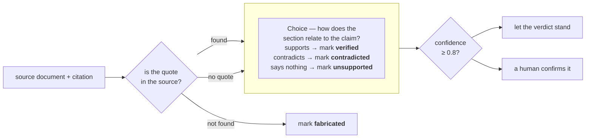

# 复核引用

> 对照源文档检查，抓出错误或凭空捏造的引用。一个 Choice 问题判断引文的上下文是否支持该论断。

LLM 回答问题时会附上引用：每条论断给出源文档的某一节，以及支撑它的引文。这些引用有的错误、有的是凭空捏造：引文可能根本不在文档里，也可能逐字出现在文档中，而它所在的上下文恰恰与论断相反。

人工核查很慢：先找到文档，再在文档里找到引文，然后读足够多的上下文，才能判断它是否支持这条论断。

要把这一步自动化，先用普通的字符串匹配找出文档里根本没有的引文，再用一个 `Choice` 问题阅读每条剩余引文的上下文，判断它是否支持该论断。



下面让 LLM 关于 RFC 7519（JSON Web Token）的答案里的八条引用走一遍检查。四条正确的引用都以 0.93 以上的置信度返回 `verified`。四条刻意埋下的问题全被抓出：一条编造的引文、一条被文档否定的论断，以及两条没有依据、被送交人工的引用。

本文要构建的 `check_citation()` 接收一份源文档和一条引用，返回四种判定之一：`verified`、`unsupported`、`contradicted` 或 `fabricated`。它还会返回置信度，用来标出需要人工过目的那几条。

## 环境准备

```bash theme={null}
pip install ipython 'cooksafe>=0.2.0,<0.3.0'
```

然后设置 `TYPESAFE_API_KEY`。每次 API 调用都会缓存到随 cookbook 一起提供的 `json_cache.json` 里，因此重跑时直接回放已发布的数字，不会再调用 API。删掉该文件即可全部实时运行。

下面的数字来自 2026-08-16 的 `jev-1.12`。

```python theme={null}
import json
import os
import re
from pathlib import Path
from time import perf_counter

from cooksafe import JsonCache, make_playground_link
from IPython.display import Markdown, display
from typesafe_sdk import Choice, TypeSafeClient

TYPESAFE_MODEL = "jev-1.12"
AUTO_ACCEPT = 0.8  # start high for more human review as you build trust in the model

client = TypeSafeClient(
    api_key=os.environ.get("TYPESAFE_API_KEY", "cache-only"),
    base_url=os.environ.get("TYPESAFE_ENDPOINT"),
    timeout=120.0,
)
json_cache = JsonCache(Path("json_cache.json"))
```

## 加载源文档与引用

源文档是 [RFC 7519](https://www.rfc-editor.org/rfc/rfc7519.html)（JSON Web Token），从 rfc-editor.org 抓取后与这篇 cookbook 放在一起，保存为 `rfc7519.txt`。下面的代码去掉页眉和页脚，再把正文切成带编号的各节。

`citations.json` 里的八条引用都由 LLM 针对这份 RFC 写出。其中四条准确，另外四条被改成通不过检查的样子。

```python expandable theme={null}
def load_source() -> str:
    """RFC 7519 verbatim, minus the page headers and footers that interrupt its paragraphs."""
    lines = []
    for line in Path("rfc7519.txt").read_text().splitlines():
        bare = line.lstrip("\f")
        if re.match(r"Jones, et al\.\s.*\[Page \d+\]$", bare):
            continue
        if re.match(r"RFC 7519\s+JSON Web Token \(JWT\)\s+May 2015$", bare):
            continue
        lines.append(bare)
    return re.sub(r"\n{3,}", "\n\n", "\n".join(lines))


def split_sections(source: str) -> dict[str, str]:
    """Map each numbered section ("4.1.3") to its text, split on the RFC's header lines."""
    boundary = re.compile(r"(?m)^(?:(\d+(?:\.\d+)*)\.  .+|Appendix [A-Z]\..*)$")
    marks = list(boundary.finditer(source))
    sections = {}
    for mark, nxt in zip(marks, marks[1:] + [None]):
        if mark.group(1) is None:  # an appendix header only terminates the section before it
            continue
        sections[mark.group(1)] = source[mark.start() : nxt.start() if nxt else len(source)].strip()
    return sections


SOURCE = load_source()
SECTIONS = split_sections(SOURCE)
CITATIONS = json.loads(Path("citations.json").read_text())

print(f"{len(SOURCE):,} characters, {len(SECTIONS)} numbered sections, {len(CITATIONS)} citations")
print("\nA citation with a quote:")
print(json.dumps(CITATIONS[1], indent=2))
print("\nA claim-only citation:")
print(json.dumps(next(c for c in CITATIONS if c["quote"] is None), indent=2))
```

```
58,365 characters, 45 numbered sections, 8 citations

A citation with a quote:
{
  "id": "aud_reject",
  "claim": "If a validator does not find itself in a token's audience list, it has to reject the token.",
  "quote": "If the principal processing the claim does not identify itself with a value in the \"aud\" claim when this claim is present, then the JWT MUST be rejected.",
  "section": "4.1.3"
}

A claim-only citation:
{
  "id": "iat_future",
  "claim": "The \"iat\" claim requires validators to reject tokens whose issue time is in the future.",
  "quote": null,
  "section": "4.1.6"
}
```

## 在源文档中查找每条引文

源文档里找不到的引文就是编造的，这一步不需要模型。先把空白和弯引号归一化，让引文跨过 RFC 的换行也能匹配，再按子串查找。匹配结果还告诉你引文出自哪一节，那一节的文本就是下一步交给模型读的内容。

有的引用只指明某一节，并没有摘引其中的内容。这种情况没有可匹配的字符串，直接取它指出的那一节交给模型。

```python theme={null}
def normalize(text: str) -> str:
    """Collapse whitespace and fold curly quotes, so a quote matches across line wraps."""
    table = str.maketrans({"“": '"', "”": '"', "‘": "'", "’": "'"})
    return re.sub(r"\s+", " ", text.translate(table)).strip()


def find_quote(sections: dict[str, str], quote: str) -> str | None:
    """The number of the section that contains the quote verbatim, or None."""
    needle = normalize(quote)
    for number in sorted(sections, key=lambda n: [int(p) for p in n.split(".")]):
        if needle in normalize(sections[number]):
            return number
    return None


def locate(sections: dict[str, str], citation: dict) -> tuple[str, str | None]:
    """Step 1 for one citation: a status, plus the section step 2 will read."""
    if citation["quote"] is None:
        return "section-only", sections[citation["section"]]
    number = find_quote(sections, citation["quote"])
    if number is None:
        return "missing", None
    return "found", sections[number]


for citation in CITATIONS:
    status, section = locate(SECTIONS, citation)
    where = f"section of {len(section):,} chars" if section else "not in the source"
    print(f"{citation['id']:<18}{status:<14}{where}")
```

```
epoch_seconds     found         section of 3,122 chars
aud_reject        found         section of 761 chars
sig_reporting     missing       not in the source
clock_skew        found         section of 529 chars
exp_required      found         section of 529 chars
pii_encryption    found         section of 1,653 chars
iat_future        section-only  section of 270 chars
duplicate_names   found         section of 918 chars
```

## 验证源文档是否支持该论断

走到这一步还带着引文的引用，说明它的引文与源文档逐字一致。这还不够：引文可能准确，而建立在它之上的论断仍然是错的。要判断这一点，需要看引文的上下文，也就是第 1 步找到的那一节。

每条存活的引用问一个 `Choice` 问题，覆盖某一节与论断之间可能的三种关系。概率最高的选项就是判定结果，`AUTO_ACCEPT`（上面代码里是 0.8）决定它接下来怎么处理：

* 置信度不低于 0.8：判定直接生效；
* 低于 0.8：先由人工确认，再据此行动。

先把阈值设高一点，看到模型在自己文档上的表现之后再逐步下调。

```python expandable theme={null}
QUESTIONS = {
    "relation": Choice(
        instructions="How does the section relate to the claim?",
        criteria={
            "supports": "The section states the claim or directly implies that it is true",
            "contradicts": "The section states the opposite of the claim or implies it is false",
            "says_nothing": "The section does not address what the claim asserts, either way",
        },
    ),
}

RELATION_TO_VERDICT = {
    "supports": "verified",
    "contradicts": "contradicted",
    "says_nothing": "unsupported",
}


@json_cache
def ask(claim: str, section: str) -> dict:
    started = perf_counter()
    response = client.system_one(
        state={"claim": claim, "section": section},
        questions=QUESTIONS,
        model=TYPESAFE_MODEL,
    )
    answer = response.answers["relation"]
    return {
        "choice": answer.choice,
        "probabilities": answer.probabilities,
        "confidence": answer.confidence,
        "seconds": round(perf_counter() - started, 2),
        "input_tokens": response.usage.input_tokens or 0,
        "output_tokens": response.usage.output_tokens or 0,
    }


def verdict(status: str, answer: dict | None) -> dict:
    """Fold step 1 and step 2 into one of the four labels, plus an auto-or-review flag."""
    if status == "missing":
        # confidence None: no model was called, so there is no model confidence to report
        return {"verdict": "fabricated", "confidence": None, "auto": True}
    return {
        "verdict": RELATION_TO_VERDICT[answer["choice"]],
        "confidence": answer["confidence"],
        "auto": answer["confidence"] >= AUTO_ACCEPT,
    }


def check_citation(sections: dict[str, str], citation: dict) -> dict:
    status, section = locate(sections, citation)
    answer = ask(citation["claim"], section) if section is not None else None
    return {"id": citation["id"], "status": status, "answer": answer, **verdict(status, answer)}
```

## 检查全部引用

八条引用都走同一套检查：

```python theme={null}
print(f"{'citation':<18}{'quote':<14}{'relation':<14}{'conf':>6}  {'verdict':<13}{'action':>7}")
for citation in CITATIONS:
    result = check_citation(SECTIONS, citation)
    answer = result["answer"]
    relation = answer["choice"] if answer else "-"
    conf = f"{answer['confidence']:.2f}" if answer else "-"
    action = "auto" if result["auto"] else "review"
    print(
        f"{result['id']:<18}{result['status']:<14}{relation:<14}{conf:>6}"
        f"  {result['verdict']:<13}{action:>7}"
    )
```

```
citation          quote         relation        conf  verdict       action
epoch_seconds     found         supports        0.93  verified        auto
aud_reject        found         supports        0.95  verified        auto
sig_reporting     missing       -                  -  fabricated      auto
clock_skew        found         supports        0.99  verified        auto
exp_required      found         contradicts     0.99  contradicted    auto
pii_encryption    found         says_nothing    0.27  unsupported   review
iat_future        section-only  says_nothing    0.56  unsupported   review
duplicate_names   found         supports        0.99  verified        auto
```

四条引用返回 `verified`，一条返回 `fabricated`，一条返回 `contradicted`，两条返回 `unsupported`。

* `epoch_seconds`、`aud_reject`、`clock_skew` 和 `duplicate_names` 就是准确的那四条，都以 0.93 以上的置信度返回 `verified`，远高于 `AUTO_ACCEPT`。
* `sig_reporting` 根本没到模型那里。它的引文不在 RFC 中，仅靠字符串匹配就判定为 `fabricated`。
* `exp_required` 逐字摘引了 4.1.4 节，而同一节写着 "Use of this claim is OPTIONAL"，因此被判为 `contradicted`，置信度 0.99。
* `pii_encryption` 和 `iat_future` 以 0.27 和 0.56 返回 `unsupported`，都低于阈值，因此都转给了人工。`pii_encryption` 说明了为什么光靠字符串匹配不够：它的引文与源文档逐字一致，但引文所在的那一节对这条论断只字未提。

要用在自己的数据上，替换 `rfc7519.txt` 和 `citations.json` 即可。`load_source()` 和 `split_sections()` 是按 RFC 的排版写的，换成别的格式的文档就得自己写解析。

归一化之后字符串匹配是精确匹配：被截断或稍有改写的引文都会判成 `fabricated`。如果生产系统要容忍不严谨的引用方式，就得改用模糊匹配。

## 在 TypeSafe playground 中打开

链接里装着一条引用的论断和它所在的小节，还有那个问题。打开即可在浏览器里实时跑同一次调用。

```python theme={null}
example = next(c for c in CITATIONS if c["id"] == "exp_required")
_, example_section = locate(SECTIONS, example)
playground_link = make_playground_link(
    {"claim": example["claim"], "section": example_section}, QUESTIONS, models=[TYPESAFE_MODEL]
)
display(Markdown(f"🔗 [Open one citation's claim + section in the TypeSafe playground]({playground_link})"))
```

<a href="https://console.typesafe.ai/playground#share/N4IgJg9gxgrgtgUwHYBcAqCAeKQC4AEIwAOiFADYCGAlnKQaQKIBuCATgJ74BSA6mvjgwAzinzUkFGGAT5KSfFgAO1NpRTUICjYgDcc-CggBrZPgDu1FAAsIMMcUchlj0uOH4kEMc0rlqYAB0pAA0+KTCCFAaWvThIAAsgQCMgUn44U4uTvgAFIyYKmoxCmi0CACU+ADCVLSOSA0Z+GjWsq7OhR15yqrqmtrlVRQ0cOIyqNQAZtQIHjayvcUDhuX4scQKGRBsclMo7BbW1FDWhm08-PgAsgCqAMoCAHIA8gIARrKUUFAISgdgfBTHb4JRsaBzYQSADmgQyrQQTQyYIhwihSGh6ym53aWS6ORGtHwbAQAEcYKo5ud1Dj8LA2CTUPgwOoEAB6HSIzbNO6PfCffkIYEk2lLfpaZmsjlrfyiBCAiS0jrZNyEuDBTZI-AASTgSnICEQqHYHmuAEEAJqg8HMAKyYX4YQQRCOuB+cj4A0IcyUDhhEQwd1cLyCHayGzyLWUIHewQSexzMJGOQ-OxMh0UaDGR2mcxwnUoDy+cgwWS8j5fTzwT5sLVQLQoGhIGEGJ7wdgnAAirPwxdL+dukSx52oHjV7nwLwACmhtS8nmaADLBEAAXxAYRAKL1hYw2DwhBIIBJVBKcSPKA4SkRB9IpwgJxvYVIElEbBg0QGwjipAAEhBzGZCAqQWR0ohKYkEFPcMIFpNUAH5QniKA2CsDtKHPCIYCUJQdkLH8QARMDPwlURWXmC5xxBMBKWicguFofVZgomkrAnFB3yfZCGzUGjom-W9CIuSISIUMiDgo2QIBwiAoQOYdQKo3ZGP8Kk2NHIE-EiJCIl9YQAH0vBsGECKIkSIMgKkjLkMAwBJNEjhpRS6jGSg0XYQswgQKw2l2H0OFIVcgo3QhKBUAA1E0BgPEBmGSEKQEiA1onla4IBkchhAPABtEAACsEGYABaVJkgAJhAABdVcgA" target="_blank" rel="noreferrer" className="text-primary">在 TypeSafe playground 中打开一条引用的论断和所在小节 →</a>
