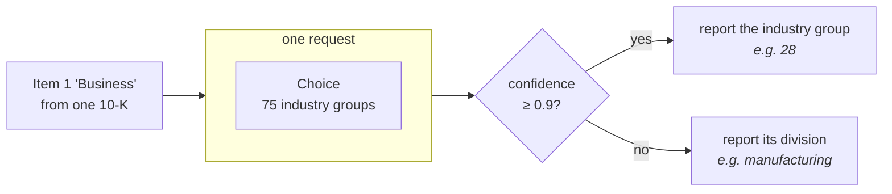

# 用置信度做分类

> 每份文档一条 Choice 问题，把 SEC 年报分类到 75 个行业组，再读取答案自身的置信度，决定是报告这个行业组，还是报告它上面更宽的部类。

每家向 SEC 提交年报的公司都会在年报里描述自己的业务。这里把这些描述按标准行业分类（Standard Industrial Classification）归类：75 个行业组，每份文档一条 `Choice` 问题。

大多数申报文件都不难。地区银行就是地区银行。有些则不然：刚卖掉两个业务板块之一的公司，或者描述自己打算进入、而非正在经营的业务的初创公司。不管怎样，模型都得挑出一个行业组，而难题的答案和简单题的答案看起来没有区别。要把难题和简单题区分开，通常正是成本所在：再上一个模型、额外的调用、人工复核。

Choice 已经告诉你了。除了胜出的选项，它还会返回 `confidence`：几乎所有概率都落在一个选项上时它高，概率摊到好几个选项上时它低。这一个数字就把可信的答案和不可信的答案分开了。

拿到不可信的答案后该怎么办，取决于你的标签体系。SIC 标签构成一个层级：行业组向上归入更宽的部类。这让一次响应几乎不额外花成本。当模型对行业组没把握时，就报告它所属的部类。宽标签由窄标签推得，不需要第二次调用。

在 60 份申报文件上，0.9 的置信度分界线把它们一分为二。有把握的那一半 90% 是对的；另一半只有 40%。往上报告一级之后，这 40% 变成 70%。最后得到一个 `classify()` 函数，它返回一个标签以及这个标签有多具体，每份文档一次请求。



## 环境准备

```bash theme={null}
pip install ipython matplotlib 'cooksafe>=0.2.0,<0.3.0'
```

然后设置 `TYPESAFE_API_KEY`。每次 API 调用都会缓存到随 cookbook 一起提供的 `json_cache.json`，所以重新渲染时直接重放已发布的数字，不会调用 API。删掉这个文件就能全部实时重跑。

下面的数字来自 2026-08-12 的 `jev-1.12`。

```python theme={null}
import json
from collections import defaultdict
from pathlib import Path

import matplotlib
import matplotlib.pyplot as plt
from cooksafe import JsonCache, make_playground_link
from IPython.display import Markdown, display
from typesafe_sdk import Choice, TypeSafeClient

matplotlib.use("Agg")  # headless render

import os  # noqa: E402

TYPESAFE_MODEL = "jev-1.12"
CONFIDENT = 0.9  # above this the group is reported; below it, the division

client = TypeSafeClient(
    api_key=os.environ.get(
        "TYPESAFE_API_KEY", "cache-only"
    ),  # keyless kernels replay the cache
    base_url=os.environ.get("TYPESAFE_ENDPOINT"),
    timeout=120.0,
)
json_cache = JsonCache(Path("json_cache.json"))
```

## 构建分类体系的两级

`sic_codes.tsv` 是 SEC 公布的行业列表，供申报者从中挑选自己的代码，抓取于 2026-08-10：444 个四位代码，每个都带一个行业名称。这些数字本身就是一层层级：前两位是**行业组（major group）**，这里共 75 个，从 `01` 农业生产到 `99` 无法分类；固定范围的行业组则构成十个**部类（division）**，这是 SIC 最粗的一层划分。

两级都从这一个文件里得到，不用模型：先按前两位给代码分组，再把这些两位数字映射到一个部类。

```python expandable theme={null}
DIVISIONS = [
    (1, 9, "agriculture, forestry and fishing"),
    (10, 14, "mining"),
    (15, 17, "construction"),
    (20, 39, "manufacturing"),
    (40, 49, "transportation, communications and utilities"),
    (50, 51, "wholesale trade"),
    (52, 59, "retail trade"),
    (60, 67, "finance, insurance and real estate"),
    (70, 89, "services"),
    (91, 99, "public administration"),
]

INDUSTRIES: dict[str, str] = {}
for line in Path("sic_codes.tsv").read_text().splitlines()[1:]:
    code, _office, title = line.split("\t")
    INDUSTRIES[code] = title.lower()

GROUPS: dict[str, list[str]] = defaultdict(list)
for code in sorted(INDUSTRIES):
    GROUPS[code[:2]].append(code)


def division(group: str) -> str:
    number = int(group)
    return next(name for low, high, name in DIVISIONS if low <= number <= high)


print(
    f"{len(INDUSTRIES)} industries -> {len(GROUPS)} major groups -> {len(DIVISIONS)} divisions"
)
print(
    f"  group 35 = {division('35')} / {', '.join(INDUSTRIES[c] for c in GROUPS['35'][:3])} ..."
)
```

```
444 industries -> 75 major groups -> 10 divisions
  group 35 = manufacturing / engines & turbines, farm machinery & equipment, lawn & garden tractors & home lawn & gardens equip ...
```

Choice 问题需要为每个选项提供描述，而行业组自己的名称并不总是存在：75 个里有 42 个在 SEC 的列表中带有总括名称，其余的没有。所以每个行业组都用它下面的行业来描述，这也正是读申报文件的人会拿来对照的东西。

```python theme={null}
MAX_NAMED = (
    8  # industries listed per group; enough to characterise it without a wall of text
)


def describe(group: str) -> str:
    umbrella = INDUSTRIES.get(f"{group}00")
    inside = [INDUSTRIES[c] for c in GROUPS[group] if c != f"{group}00"][:MAX_NAMED]
    listed = "; ".join(inside)
    return (
        f"{umbrella} — includes: {listed}"
        if umbrella and listed
        else (umbrella or listed)
    )


print(f"group 20: {describe('20')[:150]}")
print(f"\ngroup 65: {describe('65')[:150]}")
```

```
group 20: food and kindred products — includes: meat packing plants; sausages & other prepared meat products; poultry slaughtering and processing; dairy product

group 65: real estate — includes: real estate operators (no developers) & lessors; operators of nonresidential buildings; operators of apartment buildings; less
```

## 申报文件

`filings.jsonl` 里有 60 份年报（10-K），每份都裁剪到 Item 1 "Business" 一节，也就是公司描述自己做什么的那部分，也是行业代码唯一关心的部分。它们跨 1993–2024 年，长度从 700 到 2,200 词。每份都带有申报者自己选的 SIC 代码，还有用于在 EDGAR 上查到它的 accession number。

在看任何准确率数字之前，先要弄清这个标签的来历。它是自行申报的：准备申报文件的人选了一次，而当公司卖掉代码所指的业务却保留代码时，它就过期了。这 60 份已被筛选为文本支持其所带代码的申报文件，所以这里的数字衡量的是这套配方，而不是 EDGAR 元数据的现状。

```python theme={null}
FILINGS = [json.loads(line) for line in Path("filings.jsonl").read_text().splitlines()]
example = FILINGS[7]
print(
    f"{len(FILINGS)} filings, {sum(f['words'] for f in FILINGS) // len(FILINGS)} words on average"
)
print(f"\n{example['id']} (filed {example['year']}, accession {example['accession']}):")
print(f"  {example['text'][:230]}...")
print(f"  filer's code: {example['sic']} {INDUSTRIES[example['sic']]}")
```

```
60 filings, 1438 words on average

1389870_2008 (filed 2008, accession 0001079974-09-000155):
  Item 1. DESCRIPTION OF BUSINESS. NARRATIVE DESCRIPTION OF THE BUSINESS Across America Financial Services, Inc. is a corporation which was formed under the laws of the State of Colorado on December 1, 2005. Until March 23, 2007, we...
  filer's code: 6163 loan brokers
```

## 问一条 Choice 问题，然后读置信度

一条 `Choice` 问题，选项就是这 75 个行业组。整个分类体系可以装进一次请求：Choice 在约 240 个选项以内都能稳定工作，75 远在其内。

答案回来时带有 `choice`，即胜出的行业组；`probabilities`，即这 75 个选项各自的权重；以及 `confidence`，它说明这份权重分布有多集中。这套配方读的是 `confidence`，而不是胜出者自己的概率。胜出者 0.45、第二名 0.44，和胜出者 0.45、其余权重稀疏散落，是两种不同的情况，而 `confidence` 正是区分它们的东西。

```python theme={null}
QUESTION = (
    "Which broad industry does this company operate in? Judge the company's own operations "
    "as this filing describes them."
)


def questions() -> dict:
    return {
        "group": Choice(
            instructions=QUESTION,
            criteria={group: describe(group) for group in sorted(GROUPS)},
        )
    }


@json_cache
def ask(filing_id: str, text: str) -> dict:
    response = client.system_one(
        state=text, questions=questions(), model=TYPESAFE_MODEL
    )
    answer = response.answers["group"]
    return {
        "group": answer.choice,
        "confidence": answer.confidence,
        "probabilities": dict(answer.probabilities),
    }
```

## 有把握就报行业组，没把握就报部类

下面四行就是整套配方。置信度在 0.9 及以上时，答案以行业组的形式报告；低于这个值，同一个答案就以该行业组所属的部类来报告。

每份申报文件仍然会得到一个可用的标签。模型没把握分类的那些，会退回到上一层，而不是被丢弃或转走。如果部类对你的应用来说太粗、不足以据此行动，这个分支就是把它交给人处理的地方。

```python theme={null}
def classify(filing: dict) -> dict:
    answer = ask(filing["id"], filing["text"])
    sure = answer["confidence"] >= CONFIDENT
    return {
        "level": "group" if sure else "division",
        "label": answer["group"] if sure else division(answer["group"]),
        "confidence": answer["confidence"],
        "group": answer["group"],
    }


def show(filing: dict) -> None:
    result = classify(filing)
    named = describe(result["group"]).split(" — ")[0][:46]
    print(
        f"  {filing['id']:>13}  conf {result['confidence']:.2f}  -> {result['level']:<8} "
        f"{result['label']:<14} (group {result['group']}: {named})"
    )


print("three filings the model was sure about:")
for f in sorted(FILINGS, key=lambda f: -ask(f["id"], f["text"])["confidence"])[:3]:
    show(f)
print("\nthree it was not:")
for f in sorted(FILINGS, key=lambda f: ask(f["id"], f["text"])["confidence"])[:3]:
    show(f)
```

```
three filings the model was sure about:
    310158_1996  conf 1.00  -> group    28             (group 28: chemicals & allied products)
     33416_1998  conf 1.00  -> group    63             (group 63: life insurance; accident & health insurance; h)
    352541_1996  conf 1.00  -> group    49             (group 49: electric, gas & sanitary services)

three it was not:
   1372167_2013  conf 0.22  -> division manufacturing  (group 38: search, detection, navagation, guidance, aeron)
   1398633_2009  conf 0.23  -> division wholesale trade (group 50: wholesale-durable goods)
     46653_1999  conf 0.29  -> division services       (group 87: services-engineering, accounting, research, ma)
```

这些置信度与每份申报文件的分类难度是吻合的。三个 1.00 的分别是制药商、寿险公司和公用事业公司；三家在纸面上都是控股公司，但每一家都有一个申报文件直接点明的主营业务。底部那三个之所以更难，原因在文本里读得出来。两个是发展阶段的公司，描述的是自己打算开展的业务（Nevaeh "intends to operate as a software developer"，Barricode "organized to enter into the computer security software industry"），第三个有两个业务板块，并在申报前几周卖掉了其中一个。这三份返回的是部类而不是行业组。

`classify()` 就是整套配方。把 `ask()` 指向你自己的文档，再按你自己的分类体系重写 `describe()`，其余部分照搬即可。

## 更宽的答案换来了什么

全部 60 份申报文件，都按各自申报者选择的代码评分，在两种策略下各算一遍：每次都报行业组，或者只要置信度低于 0.9 就报部类。

```python theme={null}
def correct(filing: dict, result: dict) -> bool:
    gold_group = filing["sic"][:2]
    if result["level"] == "group":
        return result["label"] == gold_group
    return result["label"] == division(gold_group)


results = [(f, classify(f)) for f in FILINGS]
sure = [(f, r) for f, r in results if r["level"] == "group"]
unsure = [(f, r) for f, r in results if r["level"] == "division"]

forced = sum(r["group"] == f["sic"][:2] for f, r in results)
broadened = sum(correct(f, r) for f, r in results)

print(f"forced to name a group every time      {forced}/{len(results)} right")
print(
    f"  of those, the {len(sure)} it was sure about  "
    f"{sum(r['group'] == f['sic'][:2] for f, r in sure)}/{len(sure)} right"
)
print(
    f"  and the {len(unsure)} it was not           "
    f"{sum(r['group'] == f['sic'][:2] for f, r in unsure)}/{len(unsure)} right"
)
print(
    f"\nletting it answer coarsely when unsure  {broadened}/{len(results)} useful answers"
)
```

```
forced to name a group every time      39/60 right
  of those, the 30 it was sure about  27/30 right
  and the 30 it was not           12/30 right

letting it answer coarsely when unsure  48/60 useful answers
```

在模型有把握的地方，它报出的行业组十次里有九次是对的。在没把握的地方，报行业组的错误率高于正确率，只有 40% 是对的。把这些同样的答案以部类报告，就提到 70%。

这张图把两种策略并排放在一起，并按模型是否有把握分组。

```python expandable theme={null}
labels = ["sure\n(group reported)", "unsure\n(division reported)"]
forced_split = [
    sum(r["group"] == f["sic"][:2] for f, r in sure) / len(sure),
    sum(r["group"] == f["sic"][:2] for f, r in unsure) / len(unsure),
]
broad_split = [
    sum(correct(f, r) for f, r in sure) / len(sure),
    sum(correct(f, r) for f, r in unsure) / len(unsure),
]

fig, ax = plt.subplots(figsize=(7, 3.6))
x = range(len(labels))
ax.bar(
    [i - 0.19 for i in x],
    forced_split,
    0.38,
    label="always name a group",
    color="#c8ccd4",
)
ax.bar(
    [i + 0.19 for i in x],
    broad_split,
    0.38,
    label="answer broadly when unsure",
    color="#3b6ea5",
)
for i, (a, b) in enumerate(zip(forced_split, broad_split)):
    ax.text(i - 0.19, a + 0.02, f"{a:.0%}", ha="center", fontsize=9)
    ax.text(i + 0.19, b + 0.02, f"{b:.0%}", ha="center", fontsize=9)
ax.set_xticks(list(x))
ax.set_xticklabels(
    [f"{lab}\nn={n}" for lab, n in zip(labels, [len(sure), len(unsure)])]
)
ax.set_ylabel("labels that are right")
ax.set_ylim(0, 1.12)
ax.set_title("Where the broader answer helps: the filings it was unsure about")
ax.legend(frameon=False, loc="upper right")
ax.spines[["top", "right"]].set_visible(False)
plt.tight_layout()
display(fig)
```


## 在 Playground 中打开

这个分享链接里有一份申报文件和那条 75 个选项的问题，不用写任何代码就能看到它产生的分布和置信度。

```python theme={null}
playground_link = make_playground_link(
    example["text"], questions(), models=[TYPESAFE_MODEL]
)
display(
    Markdown(
        f"🔗 [Open the filing + question in the TypeSafe playground]({playground_link})"
    )
)
```

<a href="https://console.typesafe.ai/playground#share/N4IgJg9gxgrgtgUwHYBcAqCAeKQC4AEIAkignPgIwB0+AIgKIDKAwgEpEAKaRA8gHL4eAMXwAhAKqMifJoxp8Agq1YLuANXp0mbTt36CRaABKaJUmY0b4FUAE4QAzg+uJbASygBDfELdJPSFBungA2+IwItgBuHggOADT4RIE0bs7eUBC2AA5ZnihuEEj4AO4AFh5lpZ7OAGZZiGD4MEhgkfgoZQj4IZ4lzhC1HV3hKPndg-jMECF5kPhFdAhQZABG7RSJAEwADDsArDTiqG5hALKetlBVWwDM23sA7Ikl3a+23d7lMyEAngC0EBKSAQTQcMFWDjcYGCtl+CyGzE82VItls3l8-kCwTCAHF7DBsolklAqIl6rZXH98ABrJBA4o1ax2RzOBSuDzeVgIUL4egOMakKZZbJUAAUgBwCZgKLiAXAIAJQ0HjFABSARgl3hFB2Dx2z2G3RhHygKCyA0RMrQ+GR2XsUVBiXBqwAVssUB0IAb8AharU3W57SCnAjrfgPgBzNIodEFRYlNydL0RWDuApxa2tPmYa4BcPdaZwOBpKFFRKdbq2z0x7wObJ+QG+kM2ezB9mRTk+PwBIK8iLRWIJJIpfBizHdnHhSIxFYOeUeqaW-AOMqXBBlGZtWzmsPLLJNRYXK5VTb4XZ6haM-CVsP5byrGppGiMPwrBdcQCYBM5VjAoUHnGkd16UgmlNL1K1yBxQWtE0AwTNx00mMdsV7KcBy9aUuHwI03TNLDlmhKCE2qf9inLfB1gFfA-FROJ3UmDCrQCJokJ7MI+2ndMmLfNBPyXFcPnXEJN2cUDa3rQYhhYid2LQ0CiyQNwiwAL0+JB4VyUgTl5SZMiQWoQg8OihmoyJaJoNARmXVdtyklD+xnUpTIWYEoNWeEGJedcsKjdxv2A0NTTGMJJk2AAObV4gAFkeAA2PjrPnMiGPigSN0iAZiiya1VggGB3UPa5T3uU8niVVV1U1Sgtl1fUAgWWxwwCNwlPyQpin8Rpwk8P18CMS4ctsJJEgAGWG5gyXwCkqXhOkGWtZxGG67o+tsAaxB-Pw4mcWgEHtWZskQVBhTgbIAnhSVFp6laBoVTzKio9JfVOYJ-PjRNcsG3oGtolK1zS2xElxWhRAUId7QFQ6UEHUbmESTxww+KDQMrGI2gWbJIlapBw3wLw6yCqjSJGKaQ28WY6smAASLZ9h1PYdnnTJ7UGiAMZjPwcawDGkEghxzIqZxyeKEomTAGAJnKpANThKqHm1GgjCBXbIkSH0-Rg+1BBNCB1kGigYt1UKXgrTxoQRIYyNtF83FOsIuM8KA7HFpoTI+SixYlhYYE+iA6tAy7lv6rKdr21nIeO061Lh9InDccMQRAz0A96oO9ZGsaaAUd0yIcTxEA6RSEGN71UFMl3UE9MnfcZNFczIZB3TeqoAHUfrOXLUFN4oOHcRB0-Gu7CoA7rame8Ymibr3Bp7uICNQRIzlsGgAGkQjIBwlJoVvyKyexXiaSmKFuar6cm+xyFbyj25aMY-HwHvC-7+cUYI9HMYKbHceRBNeVApn2lZu-Dm3pMDc15vzACQsHrelRsgFYTQ3IZmaDzZY3soKViLE4LI8J6RCjFGRCUfAICkAVKUCoQ9nD0hKFhcWWtTS60oAbEqOwACciQWhr2DLpZmwFM4hDCFbbEtsMzlxopRB2Tt0w31OF6IhQoAIe3qrjIoPDQT80+NkbIBkvCrDXoTMR7oYyezInI7oAEKBbAAKRXnaAEKW5AsArBRITL0ysjqdHyI5Sapswh-xUZEd0Z0rxZFjJlC2IxBFBGEVxU68IyKux+oou+5R7peEgl6G02jPC6O6EYi8sjiHdCsvwg0HxuqonIt0CgoVrFswzPYzOgS1IF3zlbLKoEyKKLAOMEMJjClwxKblKGYxWjAMiTbXkLRNwFKFHATwvw4bZ0sjMCYKI2q9JGIrISKtKnKKQKo0RnoPrKMLIsKybtvQAEcNS+M9GRIZAomJjPcEI3kecO5GS9Lgw0sE2gIPhFQLYWwaD-HwLcfAoKOCsB4BwHgjB6C0EEBwegKg9B8CsNvVcoY2ihwOg3JcYw8wnMjr8JU3s8K4vDo8ol6xGrCy6MLDRKMoLHO-L+LaV5eiZWKEQ+0cAGFsOYTFMlg0tF1RFiJSuJp5qhjgCExqNL7A0naBSE5rhWI7l5LRHp0YAi5xgkUPmggeUQD5Qwig+ozxGy8Q3Mu+jK7FAUAjBA9cjqTDOJEPMg0uIcC5SGbkWQ6XNVanGBMVQZTQrEIUe+-E5krDypyMI0wch5FCSOCNPB5RwyvO4KIPTpizHRPMTIKb2aljIaZRBxzvj8IBAyKCTooQwk1IkZsrIXDti8Mya5aQ4KLGTaKF4uUhL4FcESyeGaXhhusFCnglTgE529jEGIn8G4JlJTOyNJRh0gQZZUzI+dq2CT+ICFyYIIRNthBu8QuRihQFmL+HGZEx07NeKUHdD1wSfA9ATEKRtqlsMijFLYv1JVegzb9QSwkXGOJXNjboqrQjBXCQgNwet-2hUA8Bz9zsRFe2GU8z+5y4hlVDLUGAtbEgwhCHlVyD5BxkQg8RqD6V30Uf3MCAKxDtJDF2PECgQH4gsOw8R7cBYSXHTlcURgpooA0kzukHc4IQifM6ABXVPMHahOLtu9j+AVya28IFHj1pNH2EwIpcY1I7ijtOAZM5-EEKIggKc6TsmaQ4aglxB5IyYTYyOLer097HDAMmM+z1Oz7lPRWFuPD2FtaxcmBB3TI71gHomOSiSsRYtcXi6aLcIqlwrPNtluLaGcIA3wIvFea84AbyHXpt2cdihq39IZpZ3QCiHqGMFx96iTmrE2k0A9EmUv7jZj0qZ7QyIdW6AoJSpBCqiEKA4IIcCi5DlJIkLKDgXOGnbHmtN5YPiDH6710L4T1Pok0wa4oAEnSumlX-AJXc9kfzzNiOI0dR1ZAQxR6kMJVs-kguXcDzrXWfI9d9b1mZfUUyGAGhqTUWrabw2RD4PaPjh0mJ4GAMJ-KjyxBqx5pBIZ1HPpungAyig40nmRG0doTNkQ0-qtNiCc6OZY4loYEGuJJRcySzOs7oFkW0cgSCEwhijzXggvK+BcH4F+Agd0xZcOnU0lDQC49GYC5C2myYcyUAVK4ogToEB9xDB-Ah9pZT3vkS0+2Xkfh1ZppfDRvzON7wmkdwIkE8AijBDLBCSIsAH3D0zAETo6JMCExd21I1EGVzpBCLtnosQUFNDqlgKMYzxhHVVcz232OhgxHRGEZ3-pFhu7x8AowRA1DEj0jR5ALU8MaTXUhuJIwJSDdsE0fSMBZT4FLz+IXkaxU83nA7THqkmg4oQPtEBOfP5cXpHtUp390wePdF4YocrNZR9yuGKo96-CJo6O4UIzge1yb+I6Lo2Quh94XV0cgh+YDH69EIWgoMGemt5JWDOLzHhp4GAHmtiJ-OWG-mUASJ-geuqjiMGqEjQGcEoMvPQGgBip8B8LjN7B8KgNSPULACDvkqBFpjKt4HKrYCgAqt0KsEqiqllPASHhOGUmENqkKCzlpvHqUNOt+KcGAP8KaP8OCERI+noqdGAI6HMiUjlDHh8LfAIvYI9prqqv4KEm8pmBGG1LyAoT4qxu-sfkMl6McAmFBDJuMEamgJ6N0qQMXAZt0CuE0PSNBAUJrIAmWjzDQLQN7MAlalPASkYuGPCPGCUkQT+PkvPvtMAt4JWCoVeDbAvptDQCoM3FVqoCikQAoMNFYBZN0FbiGOiNQobj7v+JQsQrKuMJfmELUFpllHfMch4SGpPp4pbG7Pil1ggFvIaJ6ArlzG6DeMUVUTiGBusJUaiBOLUQli4mRORigGgjQMwJIGgDwGcCilYAoHwIiswKscitwGioIOSmyptMGBPoTFEDMODK4TEYplQTQfDHQQwYNKqswVcKwTyOwSTp1tdqzvHhAl+BtH+NAhUMftSCNsrnBPaOojgVivYpELlM4FCEWF9MSk1OmC-B7kuDAIVJBPZOmHfGRKYf5BYaQNuG2O4F4IVuCQUPls4KEWEA4fgM6lUZNF2MhGEG7B9A5Cbr9iAmzAUOkgSQLORICVtIVtks9CgHEjYcrIvscncbQeRE8Q8SKeysGPSXhNzPuJlOShKQZFKfOOCI7FtORrWqOpcMqnROSriRxCRMMABCCWUGCQLhCW4d0MgKXkUJDIsXgQ3Hfl4oyS4cQaaK4HUFlMcjaQON0V-EgAruGNLJHi6sMJ4m+hqWMdknoqBPMKnkaUAaaX8DQCDMwMvMNDwLiNYO6DtCsPyu0LcCeFavYaAfLp6F7jSLMOGEaqCpFBCnyGcBwKWQAJr0BMD4DbyBmehkBaIQBK4ITHbJnFDVb4CrzrxKTbbkozxNr4pcTJh6Fwj-BoBlLggfBLy9QVhcpgY4qFI9AcoeLFD7DWKTDCmdHzisqilODRlnGgQfCKTfhbgZaDRYCoJulhneolIghAGVRcTBkuaVTHFAkfBARQT9EoJGo8DkqIA1ksxDBzL+B5jhzfDWgp6eg2kIREzdCiC+x947grABjpguGgH446FhDgmaZpqIZG7ICYkUWXBNCIAQnYxGqzpQpEAYFKADlJB8BCA8CsCoEHHbxzQuHgTuDK6VTO4NDNE0C4g8AaCsB8BrF8BWisD0C4jiDDSqC8ACDPiBBvASzUjkFCndB4wOzrqkxKkQDKqVZvrzB9GgIDHhimqRBIDhwRgUbNEDCfR9BgaMlBIlHVFUQnTkGLCj74BGXwpKDMBGDWBbFaAaClkcD6VWhjmeCawgjMxLjcxNLwjvI3wuLtGXCFS5aylhxbkaxwQkZ8h8BqBEDQp6X0AGXZFTC7HDRZF8DMCaBWWvhvpFB2XSoOVfynRBAGk45uUeXFzeUVH9HSoeloZekNy8i9D9DzjRXNKxUTiKQLV0TFDJVGA8BpErGCCiBoAKDSCCDiCsDhD0DMA+BEDDV8C4hYGsl6J2I3KJDXKXCoj+lcS1j4S6EIC5DUGDiViYDwhfFk5wyZjEJP6x7qVpp04jDJi+FpjOD0DZhwZEoFiYIljFBijwrMCKgpVw0hKI3mYo2CgQ7pAY1zlqWUjNGA1QR43dC00xm7J+DQ3e6Z6ZiZB1heYdZXgQjaI7h+j4GvhTGSnwTbhkRC2eLagMwiAyaIzuh8BUD0ATTNw1AVDYymhICJC0BfW7D7CRQsJPjYlVCnW8hzJVVEW7ISJbRIVrwmj2AKReBmmIKIB6obKC2fUADkdJCAkIZh1ojcJQJQVAkEpI-lUQhWfg4M+WWuoSzgbQp01B4cu+uyukYw4tidAR4ywigFsAbpJWr4swXg-knixyNdPGo8r4Fi4KRC1BVQBaa8RKCggYtCjAMACdZ4iQQgISwo-CotiQBacwnooUBwWwkUhWj+RQ3Q9iDCbd5KXQoBYN1BrGAEYoLCjwOwc4+wtwOw-wOwx8hwo5jlvpBB8I45jk8dpAT44gog8KAAiuIH1VaPQBoAZcavgLymsBsJansNam+rah8Ickgk6ojMXlVhFjDk0HDmEgzYGsjrzROsLstp6BwLGg7AgAmsHcKKWrzWKBmlmqGFbIdvmDMMvcorQ6juUJWvCEej8HWmelifHc2nCK2iyK2ByF2jYD2lCGmgOhNGNqOhFrwYmJOio+GsLusC-kUkurBKuicFKWPnOoo+WMUGlntgETWievWuesI1egFosOdpASMC+p5W8B+qrt+sZshpQBhlhiBqJolCMExpzv9HabBnXJNFlEhhHWhr4-xphlFNhp4xLfuHlI8qMkRo5qhZePmQst5DRv5PeFCAxsE8LsxmE2xiOnNEZtxj43xgJgbMJgE9kyGOJkEhTYsDJtAPJtYIpm7BRqpk+T8dweWqmR+tFT+iZn-hZiUdZuCsifZsUIE-RC5lJqMD055qk-hhkx7v1qgy6tju4JGP4GaRiUjCuCro3B+qiPJD0osEIHHbYNLFqPWXsCwlREMN4MwGHp-E4c2XRI7L6WANGYg4RBXEgnnJxVBAcxDvOFgJpLup1pEHc2mrYZ1p6AVMeG86wi4mKq+GFiMOiyGI8-QS85QDi07RA1ixS7qIKgg6XEg-aqGGnUUJnodH8tYODuHKBAi5xV6Lc12Gizqpi-VVUHWXS3i70ASyhlhPc0MDSxQJSzQMkIRcFHOW7BjCaKU3Nty-iu6pg3hjg-6ggPgwpCjusljl3HafmVE1cLPt6L6G6CCvgPsBCiAIkCABgiiA4BgNgHgIQMAAADogAIy5TZAhsEDBsgBSkYyRv4AhvXAQCxAhuJAhui3RjYn53xshvNzkJVD0G+zlxiwCgyyQBb7CkjZBJNHyJIAAD8+AKoeORKZEVbakMdzkmUE2+dMqamdQz0n8bQq2vkFbZAVAqbCbIAdgZhl+8b0bOwFAObIA8MFJgz3sAB9gYst2-wLI2QDgE7IbOwWwS7K7Hga7ZeOa5u-wBkOdmzAAZBmJZmEGLTiETQeyAHqCewjGeypuu8+6hDOO+zsKFEuxSLRHCEBywqB2kBbeGIkGUNIivpmLqpohzO+9qEu6bu7Wfp-IACgEhM96eOcQBA-lI6UNpwZVv2DgAA3LZqtgvlyqaxEVh8FG7Oh8ewGyG4NvMfJAicoryA+wZPHAnfJBzLR9x-AH4Hx5kAJ2nsJ0KEeVMd0KJ9jOh7cEu07GjBjNGCsvAPgA++oX+0yTULR2AO4PPZ-Mm2EA+41LHfwjRwsDIjZ0yKPAvk0FzIWrzZGTOLR1Z-p8Z-2250uAB19vLssOh5FJhzhzjA+8fXCBds2UFSpfPVALZiCGXs4GKC4eRgvrOOh-sEux9pjGELomADjOXeiAls4KCk1m0FpCV0JB2b5927RSKQIelLR0Vxe6V+V0ULqlVz2fSEgLVx3g12V-ux65O-rEu4fVEPCLpKW1m+spjdNnBuRI13spRKChV3UbFvh9XkOwQCLKiI6AgO8IkHWBjAZCCIkPAf57kO8GniCJt5m7duh48Bp4aq92mqCi+7-EWo5X15V7SfgPt4EO7sR96P7dGOfturYDSO+7sKBxAObnhjSH4GZ+gpu1m84GD4R4d0o54gtej5-BPlDLR7nD+A8c4A+yt6Kh8EXVBGHe6JWFu+T8EoMzLA4L0B-mUBMUh00IAVtGJ3K2hupNj9q7R7ELjGUuQA+7UPYCpMUEO7iez7vgnOSIr8gPd+0dEP3s8wmIkPaDF1E6j39ypurbR+rw6GfBPVDEbwgHBzmnEFOKF86HnDT-gK6PPXEJ1+iHfIs5e2zxN2myAFsIu5xzGzrBIp6Kzzj6DwRxDw4AQEEI1AoaSYjxxwQCG6QNgKcMp3ZkH-H3j0nwQIW6AduoGN4vQR4LZvZ7d8QlbeJ-YBXwFcULUTX6l4s4ODheaWjKPAwg+1CCEDSLR3SAmHbt32PwpFaaiK8JcHXynlb5cNp5788x2Yj+p5HzaKuNZwsHOYTjB4L5u9uB3xSZ70iacAv4bmECX0R8n0o0gB2w+zlL8A4FHZNN7ApMuB2UOvD7jLME6BO8H2SGeCE0DT5k5aO26Q6DHUSCU04gUddGk0GdAtBCgiWWjLYHn62AoBe2J-j32LAIDbuFQISPgWf6x5I87-ZBJuAgENwHOmCFYPwgCBMc6g2SCktrlz4FAJCEvKGIj0i6R8aMmFfztulR5x9tWI4bLl-wTBoI5wd-AnrnBKDd97uXKSfnZkHBddQgtHRZsIKkLD5kALqSrFol+DaDEgQ-b7kZ20FKNMKdAnWPn30x7YHOtoH0KwM5CvQUeCCRrp7xGzb1UAIfSdjTBm4Ik-oI6cjLYBn5oIcBqPdcFbigyf9QhUgj4IkCy6ehCQgkAUGXHlC+dosf2OIfMQ+CZCu62QsITgSSHvpzcGQuWrolr49d-OCFbXCEKKEIBaORdGkvHnvwL4ogTvZuh5UHC08sh-nAULyVHjYA0EdAtIAwMY58d6h8Q7oPLzcDDC2Ok3ENlsBihLtTobMT3qAKx7m5i+ife-gQGyAUZsgi-BwciHaBT8rwpw1aJRV4qqCmhlwnKDxTexdxWML-CAJgF957IDkFwupA+zWGRAHhVFVnplyDJ9cmBW4AAPRyE4g5QsVAKA8CDh6gTnfjv5D+GDR7wG-RYWHw+6R8QQ-QVEQ-wOGVDlwoWUVPLRg7AJfhLyd7E0PbDm5E0BIskcSMs6kiiRsHHXtRBF45R3KDI1kSSIqEGQmRJvQRNSJ3juUc0HI7GJoLGEMcmBfHQkQKNg5W81mLBDdhKPDCaCmo9QVLG+RAp1Y-eLqO3F4D7y+ClhIHSPtcDID0j-Omw4-tsLEGyDIeGPH8DDydz0gkcQdXGK-npFNDegcIrvsMVCCOhfgqAKoE1iQDgjnmqwXWLdwY4UZHA4gz0OGF9GzgfRNQAoP6ImJX4gxIYpTKLX85DcogFGUugvjTF7Ytwmg0EB4C7DMUvRwdT3jlBGTn5RB7PR-JcDjSUN0xG7OGpcDCpS9igMQHTv5zvjLobCwQeOI4HTFCMMmPnciIUHbJNjuBg4EoYDnHF+ipxIyGcOUN2zIgqMyuCLD4Nu5rxcwzvIumFQu6RByMiAQcJkAcCm54RiPKDpH2072A14enD4If0lHzRWxKmC4SuhN72BBgwCN2kvzo7jDZRERZsduGfG6c5e-HEIO+1vpLsCgFyB9n4HS4dBg8DnSMYP05Rpj4RpvFAFgM641BLSiNB2DSBN6QRQgOMHFGhAfbYT2gvw30emOcDrhIItHM-i4KggMT6edo+3mFygBSj6OjAkEHKOYn4TIJtHFoOCE0QhJ0E4kqAP2xCCwTlwBo1MX6LDJ5wi+kvXCRpO0n8TwKCEiPtnxABHi5ygnHkHOUgkJ8DukPeoMQiwGJCXCPE+UAhKz6Tt9IniJMTUAc7eTgwNnZMSLASHO8nALKNEbMGBCddkxTwzaOWKZLRTIJcA0ApLjlpHgagUEPyQ52rINx4OvwMzrjm0QU8zBF7e9PMn0kODG+kQeEPRJLEojFxSowIAoQ2zBE92enJiWmPaCQSEJW-EyWkIXzvp4eg4XRGmNiH+AHI9En4BSNZLf82R5wvqWEDh40ghpzE0aRQzX6TTP4igsUJkGVQLBAwKYglC6gESJF-O8xCiFL0Dr9DSA-U+oFMmUoODe4lUW8Qvjtw1SPxOMSYENyVoEhnALHB6ZZhljNjluXzAQX4HgAU9dwrQJ6YgAt6fw3p0XEMF9MiA-SlGQULCRtJolFEppCLZ5piU+lFBvpfHP6QhL4EmSWOMZOgclz4g2w6wn8e8GiFy5UZnmdWRIMqg7L3cfEWUvKGvFEb6YmIpoGYJ73UEMkeKQUxofpksnAIEAPaIkCAicTugF8ywIQW2OtBoZaOTE+AINk-hDDchHww+nbmlkT08U88OWXDQVnQ8KSysykKrOeJf81pHE5wS3QbTFT3aVMySajN5CQAzQjoc2pryhY98NwHMT3jDzgAOzO+2uMVEKEWkjgco+fQaMuFZh5dMRtwArpH2QAnN0wD7XIVrI+G1FrZcaC2lVP86GybYkMWjgdWKDOc+82vfriDwfbrh84Fc-zmnzq7OAS52QBqYt1uxwCEZD7YCaxKYjXccYBc2KdVKuRGzO533dZCPPS5jz25UohSJtIdiFyZYD7duQmMc579bOrJILgXOLkyzyhfnZzoFxHQzyi5a8mWWXMJglsXRviZ5nJgYzA9vZF+HxLhFMHkT0oCElYWnItkB5UutPOcorIDrn5254cEoSNgwHjybYMg3YQTwe47JAcMPPyOsiH5atX2cSH4lNA65Lg3o1wPMAvyH64KygAIzPJoh7HzEHOQCmHtQydGlsJwO-GMD+E0HEI35TJPQTGDNC0cohkEGIZkmCDWVKFFs2vtwrO4JR5eeqWjlQstlCc+eU0+MC8k5iXyG4XCwIbwpryegH2sCCckotQAITsRZMlhYNHtDkJOEHM0KfBkGhGid4MID4a9w8wv8IiOUGxdYNzrGKPAEhcGhsONJYJ7ptHOxS-LjkuKsoDcj4abCuDohag7oX4Z4to5hK7A5SWJWhniWRKS4Gcz3unM2gXCEaCEs0b1J5BHhdxi2VHP4DzSNRUc8ZaEN2A2yeB4S-gKhryAcBv9y52SVNNglMyniKF-nKYbrNiV5RPQFXQWXax3DxkgIwCEbvV387wF2C+yHaklx8F9ib5cVDNszNoFDKw6R5CHFRjSBip8mUFIHjMD8V1NmowCAfGbFNwvDlEiHGibtAHB9jFuZONZTyGDm0QEuUiqsQaTXn+0lwzWK-M0oGj5A2lAQUIL8E7Hl4eYmbSAejFBWEx7lqyiyShQQmPiTJroV4CEF5nD9mYYspQdrjFm0cUVC+XmY4KCBEzkumgjaDQvBUrL5lWEH4Bf3mJOtE4TS4zleLLDTlPBxAzHngN0EmL0wy42lf50GxQBfg96aERT3hqvTE6TpCEql38rm5Bw4FGkTzHPHYgU8-nOntaGoJRhKB-cpUQKHgDdB8VaKseWvhenq132kUHYEu395oqi2g4a7ggH+ArgKMb8dmJ+OtUt8wQRCqaYK1ObehHkrIsnOauMmTtm6snJ0N7HvCkQfiREVCYywjV1QygJQdSD5PTnTYfi5q9yTn3vkk8TemQXwu0G868r6KaGcoXYuAQlDQ1IQGEWSNS5izuFU0gYeiDzB+KUW1Y80iZCJwIZnK+pdWmssMVnxUMx+bOD8XFXmrSZk7Y7mmr1TireaDoh-m0DhrBdvAYHZrC-J5gzr9cUub8kOvNWpyTJYStdbWBCTNFHQFosWDLkSWWKPo8EeOSFwc4HqWcG6tqIkCG6rYug560EJevFUIi-gJy+CEJA2FoZxVHQVtb6sLUmiQAQGVYSdPtXAjei+QIzrZ1cmYjooSEkdcerTTgabJ4PPYRquux4V9WFsdDdQV5qTAFeg6vnpMsuD+VzVuSydkWkKCkA14W9Z7vAVQEt148La5jeuFY1rN2NYVDeQxsKTcbt6paxWQjGRBVAAFWNK8bnCJRsag6vYm8DCBbIeq0kduEnJxpA1rwYgVNNyqAXU3AJNNhqZfjkjVVWSypTGm5XpvA1KjCw-GntuBpfXhcUNSKydm8qgCJBt5Q-JqGMC553rsN+PSHh5uC54kHOhnC9tvJZyU02otHCLbyCi0-FMEaQRYA+0QW+QE0RQOLQhsi2iwfIbgZBVlqh5uhLZ0mgtQFoPQ5ywAxEz3uqqw2VahsUAlkjJMMEU9fNT0u9e+1phLsa0cQUIA6rFjogzNsqsALj1gWQ9etucNeP8DlSuK1w7izOT9jm08qslmuIfoSC0SW8yEKyKbQ6tm1ZQ3FIqrEpogMiLbcRq2hzpNv63-BulaCfziEtGnkiBKUAwSH1um0CCcJ6qhblPMWA6rttnCa7R9p2SGDjBi-aOQ+wsGRxcuL2nbddsrB+hY4RQWTq8Q1SgL8U62k7Vtqu3TaIFqIT3mzBthP4tUOiqJUVkiW4r-tb2vbZWODq7jO4e-NifjGJ1Gzw4GOzbXEC63BqQ22Oh1aiI5l1J3ZPO-4GZw-zM1WYylPzb2rS3r9IwAoSgeCFaC+LKdu2-4AwoXwXd4Ir4EbZ71wRaahdYbGLFLrzpbDg+MOgHdNoN3thQuwsp7uLKF15zyAzYwYuaUzEgShdFoosHWOtE+9bRpu5XXDuVwvjKG5Ab8CPwJQCas5oGq-F1szUgA9Cpwf4PwSEhASAxKeeDqLNXBeaeK2vFrdSDnUEB49IQa9prMYn78saSezEv3Lwj9a4phembTYL0QPa2gNeiDTfStUqUE9hdcGlSnywfC69eaCXazSo60c699Athel1dlpTRk6SRtRzsxEO129ihG7W4IJRUdAtpfHcEvst1c9e9WEjvUXu4TIB4I1lVfQsND77A919G-farr6XV6eZQsmoDMEyXGbJ8+ezfT4hv2gR65FjXPUPrP2Tt9g38kyXXrV178faPiv-emDf117oByADtsFjUxEZd9I+6-bUWRLzdABbI2fXvqX0Jyiku+rrfoqv1L6Htt24KVMMFHpKSdp+qA+Nof516yD+B4fe-oT1CaywUQSZYan1UAVf5QdREsgZYMH6BckCh9rjoLWDBCJWKbAygaX3Gg9wOvUyCWk5ZjAMYNB1vXRpDZ17JZcMrCC8hzW4SZxWhrGDjHxZz7z9bmzQ9fvoEyjRJERQvevtw116RdOMbA23nsBWwVKO+5g6PulEiTmBfEVmLTJxja61DMhj-Yaq8NuwwjCe9cFGPyamgx5jUfOAnL3bRGi9r63vYIewV16W6oQCACbzmQJ69w7QERTgY-32HsDzmqAO+xiiWqcRzRXkCjonCRqlpRUnpE0d5AtGspyot4p0YCBLSqjbWv8SRDhHzFUcfoTcJ3k9Hg0y4QxoOTCppKZalVALSaKCGK5gl+INEarZ-0CA9tah-kLMozVkZtKWjHMKozUa50gAJjxXLpWsbLwnoj1PMX7MNiQZEQHin2BwelCR3MVXjKucFVIPzoU91w1BIQii1VInFnAdgSsX8dGNLHRhwkiYY4p1Ey9oTCxgE7Fp+zUFFSLRi5VAhLSas2WtA8udXBWrYLCcVS68j4vvWhSUAiej+WCFQSpgzVmI4DEuzTqE0x58BOkQaULbdDdxLe1WKTTrgX8Atb+9k6mHhC8n0o-J+-V0sAG8022W2rk-jnm5A8tMX4J4p72b336+xOdcOKAQ4g1GepIatwD1FFrrtrKsSx2HPFJ2H0VMVQc09dhWAqKxIBMPuTToaUhdcJPMDieViSkvIZhX8cEKEANKOmqlFPNBKGZ5gWnnTBcFAHojDOWmYVMZxypcGUpbhzjLJ8dem2jNOnPgH2fiVKdixD8QuNRy-ZYa1RfEHDBPNgn6rZouqAVsWZcU1XWFzgLJVJ5ru-Fwj4zhus8OrgUE6MT1k9z2hsyDxxzNDw4FeoOeXK2jdmhgtZ8CAEnyYKrNUnxes+8bW3mlcKrGMUKqjp4HTazHBfbC3pHAF4ugcTGpo7A+TlCuUtjGELAmLMUoF8HhODbjHrgTFoRNRog1xy5QeYLRD83zjInsC-AQzGC5KXFPVz6sXIj5zhLtjinyQbjwF0Cy-OEgoHKz9Z7OrRB5bPM5dup2iM-MMmYjL6AQpjYOAAnyQcYpR27nnD3bmasaswMrmMmla0HbJD-dcKRf86zbcu77R4LHvA3-B1h3x0LbaR4vGmQ2-Fg0wEl7SfiJLYBKS4+mtAfY1sDnfiwt24Mon8cO4cVWceUT8JK8jIJS1tv4uFGh5iQBntwOfVqoVRdsagvd3Yv5H0Qj+X4BDLC3C7ys0qEy9aDkuaqFLtm4SwOCEI2FUVQ82rXOSnMjnjLvhxE23OoP4E3T15B8DJbvX-A0dR0OK7JyPGPpMzofR4OWZAASW+ls21rgzzCWncwtHM+HsAjFPJXccX5Panv0yvlqXCZnWiluGQ05WgDk7SKwifAnOASrcTcDTxY0P5XkrRVxYHWBNB3bNFBEO5KcP0kYmJLPu+cGNeKATXdZ81orcZeITrI1rU14fDNY6BzX0tBWpYy5dtKq6lrckba+NcMh3bjrhWpAGdYCsrWEik1nAuWCqIqXkrWiw66ofSvwSiLFhka65bzhW5Wd1FW3Osiw3VXXLlXHSwdwXSVcPMNbBa6Naiu9XrQcAMG+johuSzNro16BluAqBHCj1CNGocsEhuOMaMkId9qvTZPJW7TiYaG3QYID8Wss40gAWfkUkhhIAA3A3DTs2hPWZw-wKWFuCmmCXfVRortUEB7UfD+LDgdHnpecLewFLUt7xDLbapfXXLjOn+CBP4s27Gg5+dbQ1HPw620Zgx-y8LcNvUNeg-y-LEZYZsWNGbJ+KQ3eqFtxAZtYwiWSGak1qswBlt0LoRdD7hR6brloep6bC202+LyV0ENiQaP-tI7mI0KGJeBvnXdsxOUUyzYDsOAd2HKuVvN1duJ3g7nV8SwTasHE36oQaC1oalpvfnU7AVjJSCHbDYw4YV5q5WZZd5iskp258ODDfOuN39BRmt29nZ3Y9GNUTlqENQxf5zj8j5+OqkeHds53SSduW260qV3GWgVBGo6H5Y3s938Ual2GS4eHv8XVastxEhttno4UHiVKTrUneGtQs2ByvI4z-BljGhUMPrDib9lXUZ1AqgapO0Dflt3rsrk7C+ku1djqEmK1oX0GEog0sIgbQ3QEC11XT+qFRf9gAL4YPJuy7OsGoHShtQA2IAKIBQCweQRoeoIduG0BTwBsAA2iAFdBRB-g1ACxCAAAC6aDoAA" target="_blank" rel="noreferrer" className="text-primary">在 TypeSafe Playground 中打开这份申报文件和问题 →</a>
