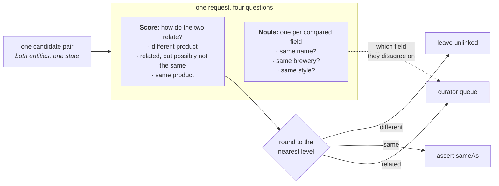

# 知识图谱实体对齐

> 用 1 个 Score 问题加 3 个配套 Noul，判断两个啤酒目录里 450 对候选中哪些描述的是同一款产品，并指出分歧出在哪些字段。

*知识图谱的一个核心问题，是判断新来的实体是否与已有实体重复，尤其当手上只有来自不同来源的自然语言时。给定可能重复的候选对，一个 TypeSafe `Score` 就能判定每一对是重复，还是值得让审核员再细看。*

假设两个数据源描述的是同一批东西的重叠部分，你需要知道一侧的哪条记录与另一侧的哪条记录指的是同一个东西。知识图谱把这类记录叫作*实体*，并保存各自记录在案的事实。某次廉价但粗糙的初筛已经比较过两个数据源，挑出了 450 对值得细看的候选。剩下的就是逐对做判断。

把两个实体错误合并的代价更高：两个实体各自的事实现在都用来描述合并后的那一个，任何指向其中之一的链接也会一并跟过来，日后要撤销就得逐一弄清哪条事实来自哪里。漏掉一次匹配只是留下一份重复，因此这个判断需要第三个选项：既不适合合并、也不该直接丢掉的中间情形。

这个判断是一个 `Score` 问题，三种结果各占一个档位：

* **不同产品** —— 两个实体不建立关联
* **相关，但可能不是同一个** —— 交给审核员定夺
* **同一产品** —— 合并它们

选 Score 问题，是因为希望把语义标签（也就是判据）直接贴在每种结果上，中间的档位也不例外。Noul 问题只能靠对输出设阈值来间接达到这个效果，而 Choice 问题会丢掉三种结果之间的顺序关系。

接下来，对实体中每个想要考察的字段，都可以用判断字段是否一致的 `Noul` 问题搭同一次请求的顺风车。如果评分既没落在「同一产品」也没落在「不同产品」档位，这些 noul 就能给审核员提供更细的信息。

最终你会得到一个 `route()`：输入一对候选，返回三种结果之一，而且没有任何需要你拿自己数据去凑的阈值。



## 环境准备

```bash theme={null}
pip install matplotlib ipython 'cooksafe>=0.2.0,<0.3.0'
```

然后设置 `TYPESAFE_API_KEY`。每次调用都会缓存到 `json_cache.json`，该文件随 cookbook 一起提供，因此重新渲染会重放已发布的数字，而不会调用 API。删掉该文件即可全部实际重跑。

下面的数字出自 2026-08-11 的 `jev-1.12`。

```python theme={null}
import json
import os
from concurrent.futures import ThreadPoolExecutor
from pathlib import Path

import matplotlib
import matplotlib.pyplot as plt
from cooksafe import JsonCache, make_playground_link
from IPython.display import Markdown, display
from typesafe_sdk import Noul, Score, TypeSafeClient

matplotlib.use("Agg")  # headless render

TYPESAFE_MODEL = "jev-1.12"
MAX_WORKERS = 6  # small pool; the public endpoint rate-limits above roughly eight

client = TypeSafeClient(
    api_key=os.environ.get(
        "TYPESAFE_API_KEY", "cache-only"
    ),  # keyless kernels replay the cache
    base_url=os.environ.get("TYPESAFE_ENDPOINT"),
    timeout=120.0,
)
json_cache = JsonCache(Path("json_cache.json"))
```

## 加载候选对

这些候选对来自一个公开的基准数据集：Magellan 数据集里的 Beer 数据，也就是从两个不同网站抓取的啤酒目录，已经被那次粗糙的初筛削减到 450 对。每个实体带四个字段：name、brewery、style 和酒精度。每一对还带有 `known_same_as`，那是基准自带的答案。

文本完全按发布时的样子保留，不做任何预处理：从未还原成字符的 HTML 实体、被拆成独立词的撇号、少量解码错误的字符，都原样留着。

每一对发一次请求，所以花销取决于交到你手上的候选对数量，而不是任何一个数据源的规模。

```python theme={null}
PAIRS = json.loads(Path("candidate_pairs.json").read_text(encoding="utf-8"))
BY_ID = {pair["id"]: pair for pair in PAIRS}

print(f"{len(PAIRS)} candidate pairs. The first one, as the model will see it:")
print(json.dumps({k: PAIRS[0][k] for k in ("entity_a", "entity_b")}, indent=2)[:420])
```

```
450 candidate pairs. The first one, as the model will see it:
{
  "entity_a": {
    "name": "C N Red Imperial Red Ale",
    "brewery": "Redwood Lodge",
    "style": "American Amber / Red Ale",
    "abv": "8.10 %"
  },
  "entity_b": {
    "name": "Kinetic Infrared Imperial Red Ale",
    "brewery": "Kinetic Brewing Company",
    "style": "American Strong Ale",
    "abv": "9.30 %"
  }
}
```

## 每对候选提一个 Score 问题和三个 Noul 问题

两个实体以 `entity_a` 和 `entity_b` 放进同一个状态，因此问题是针对*这一对*，而不是单独针对任何一侧。四个问题搭同一次请求。

下面三个档位描述就是全部决策：每个档位对应一种结果。这个文件里没有任何阈值常量。你也可以在没看过任何一个评分之前就把这些描述写好——需要拿数据去凑的数值就做不到这一点。

中间那个档位最值得仔细写。这里它覆盖变体、特别版，以及可能指代任一产品的名字，于是这些情况会送到审核员手里，而不是被合并或丢弃。

`OUTCOME` 给出三种结果的名称。合并那种结果叫 `assert sameAs`，因为 `sameAs` 是记录两个实体为同一事物的标准做法，而写出这条断言就是实际执行合并的方式。

四个字段里有三个配了 `Noul` 问题：name、brewery 和 style。酒精度没有，因为比较两个数字属于算术，需要的话在代码里算就行。要把这套做法用到别的数据上，改写 `QUESTIONS` 和 `LEVELS` 即可。其余跟啤酒有关的代码只有两个打印结果的函数，它们写出了字段名。

```python expandable theme={null}
LEVELS = [
    "They describe two different products.",
    "They describe closely related products that may or may not be the same one: "
    "a variant, a special edition, or a name that could plausibly refer to either.",
    "They describe one and the same product.",
]
OUTCOME = {0: "leave unlinked", 1: "curator queue", 2: "assert sameAs"}

QUESTIONS = {
    "link_state": Score(
        instructions="How do the two entity descriptions relate as products?",
        criteria=LEVELS,
    ),
    "same_name": Noul(
        instructions="Do the two entities state the same beer name?",
    ),
    "same_brewery": Noul(
        instructions="Are the two entities from the same brewery?",
    ),
    "same_style": Noul(
        instructions="Do the two entities describe the same beer style?",
    ),
}


@json_cache
def score(pair_id: str) -> dict:
    """One request about one candidate pair -> the score plus the three noul answers."""
    pair = BY_ID[pair_id]
    response = client.system_one(
        state={"entity_a": pair["entity_a"], "entity_b": pair["entity_b"]},
        questions=QUESTIONS,
        model=TYPESAFE_MODEL,
    )
    link = response.answers["link_state"]
    return {
        "score": link.score,
        "probabilities": link.probabilities,
        "confidence": link.confidence,
        "properties": {
            k: response.answers[k].noul for k in QUESTIONS if k != "link_state"
        },
        # tokens and requests are the durable units; don't cache a derived cost
        "input_tokens": response.usage.input_tokens or 0,
        "output_tokens": response.usage.output_tokens or 0,
    }


def route(score_value: float) -> str:
    """The whole decision rule: the nearest level names the outcome."""
    return OUTCOME[min(int(score_value + 0.5), len(LEVELS) - 1)]


def show(pair_id: str) -> None:
    pair, result = BY_ID[pair_id], score(pair_id)
    print(
        f"{pair_id}  score {result['score']:.2f}  confidence {result['confidence']:.2f}"
        f"  ->  {route(result['score'])}"
    )
    for side in ("entity_a", "entity_b"):
        e = pair[side]
        print(f"    {e['name'][:44]:<46}{e['brewery'][:30]:<32}{e['style'][:22]}")
    nouls = result["properties"]
    print(
        f"    name {nouls['same_name']:.2f}   brewery {nouls['same_brewery']:.2f}   "
        f"style {nouls['same_style']:.2f}"
    )
```

四对候选。`c446` 是同一款产品，`c427` 是两款。另外两对因为不同原因落在中间档位：`c100` 的名字和酒厂都一样，只是两个数据源对风格的措辞不同；`c428` 则把一款啤酒和它的水果加酒花变体配在了一起。

```python theme={null}
for pair_id in ("c446", "c427", "c100", "c428"):
    show(pair_id)
    print()
```

```
c446  score 1.94  confidence 0.92  ->  assert sameAs
    Thomas Hooker Old Marley Barleywine           Thomas Hooker Brewing Company   American Barleywine
    Thomas Hooker Old Marley Barleywine           Thomas Hooker Brewing Company   Barley Wine
    name 0.97   brewery 0.99   style 0.81

c427  score 0.03  confidence 0.95  ->  leave unlinked
    Frost Quake Bourbon Barrel Aged Barley Wine   Wellington County Brewery       American Barleywine
    Lompoc Bourbon Barrel Aged Proletariat Red A  Lompoc Brewing                  Amber Ale
    name 0.02   brewery 0.09   style 0.08

c100  score 1.30  confidence 0.27  ->  curator queue
    Belle Gueule Rousse                           Brasseurs R.J.                  American Amber / Red A
    Belle Gueule Rousse                           Brasseurs RJ                    Amber Lager/Vienna
    name 0.95   brewery 0.94   style 0.35

c428  score 1.10  confidence 0.77  ->  curator queue
    Ambleside Amber Ale                           Bridge Brewing Company          American Amber / Red A
    Bridge Ambleside Amber Ale - Pomegranate & G  Bridge Brewing Company          Amber Ale
    name 0.63   brewery 0.98   style 0.74
```

## 给每对候选做路由

```python expandable theme={null}
# 450 candidate pairs, one request each; a small pool keeps a live run to a few minutes.
with ThreadPoolExecutor(max_workers=MAX_WORKERS) as pool:
    scored = list(pool.map(lambda pair: score(pair["id"]), PAIRS))

scores = [result["score"] for result in scored]
by_outcome: dict[str, list[str]] = {name: [] for name in OUTCOME.values()}
for pair, s in zip(PAIRS, scores):
    by_outcome[route(s)].append(pair["id"])

SURFACE, INK, INK2, MUTED = "#fcfcfb", "#0b0b0b", "#52514e", "#898781"
GRID, AXIS, BLUE, ORANGE = "#e1e0d9", "#c3c2b7", "#2a78d6", "#eb6834"

BINS, TOP = 20, len(LEVELS) - 1
counts = [0] * BINS
for s in scores:
    counts[min(int(s / TOP * BINS), BINS - 1)] += 1
centers = [(i + 0.5) / BINS * TOP for i in range(BINS)]
queued = [c if route(x) == "curator queue" else 0 for c, x in zip(counts, centers)]
settled = [c if route(x) != "curator queue" else 0 for c, x in zip(counts, centers)]

fig, ax = plt.subplots(figsize=(7.2, 3.6), facecolor=SURFACE)
ax.set_facecolor(SURFACE)
for side in ("top", "right"):
    ax.spines[side].set_visible(False)
for side in ("left", "bottom"):
    ax.spines[side].set_color(AXIS)
ax.tick_params(colors=MUTED, labelcolor=INK2, labelsize=9)
ax.set_axisbelow(True)
ax.grid(axis="y", color=GRID, linewidth=0.8)
ax.bar(
    centers, settled, width=TOP / BINS * 0.9, color=BLUE, label="settled automatically"
)
ax.bar(
    centers, queued, width=TOP / BINS * 0.9, color=ORANGE, label="sent to the curator"
)
for edge in (0.5, 1.5):
    ax.axvline(edge, color=INK2, linewidth=1, linestyle="--")
ax.set_xticks([0, 0.5, 1, 1.5, 2])
ax.set_xticklabels(["0\ndifferent", "0.5", "1\nrelated", "1.5", "2\nsame"])
ax.set_xlabel("score for the pair", color=INK2, fontsize=9)
ax.set_ylabel("candidate pairs", color=INK2, fontsize=9)
ax.set_title(
    f"{len(PAIRS)} candidate pairs, scored once each",
    loc="left",
    color=INK,
    fontsize=11,
)
ax.legend(frameon=False, labelcolor=INK2, fontsize=9)
display(fig)
plt.close(fig)

for name in ("assert sameAs", "curator queue", "leave unlinked"):
    n = len(by_outcome[name])
    print(f"{name:<16}{n:>5}  ({n / len(PAIRS):>5.1%})")
```

```
assert sameAs      40  ( 8.9%)
curator queue      50  (11.1%)
leave unlinked    360  (80.0%)
```


`route()` 改变结论的那两个评分数值就是分界点。大多数候选对都有明确归属：360 对低于低分界点，40 对高于高分界点，剩下 50 对交给审核员。

在这份数据上，评分并不整齐地落在整数上。大多数落在 0.25 附近。两款毫无共同点的啤酒也可能共用一个风格名，酒厂名也可能长得像，于是模型会把一部分概率分给中间档位，而不是一点都不给。决定一对候选归属的是它落在分界点的哪一侧，离某个档位有多近并不参与判断。

两个分界点的拥挤程度并不相同。有 9 对落在高分界点 1.5 的 0.1 范围内，而这个点决定的是哪些会被合并进知识图谱。有 47 对落在低分界点 0.5 的同样距离内，这个点只决定审核员是否会看到这一对。两个数字都不是你去调的，它们都来自你对档位的措辞，而中间档位的措辞决定了候选对是流向审核员，还是保持不关联。

## 在 TypeSafe playground 中打开

下面的 playground 链接打开的是 `c428`，它得分 1.10，被送到了审核员那里。这一对是 *Ambleside Amber Ale* 和 *Bridge Ambleside Amber Ale - Pomegranate & Galena Hops*：同一家酒厂，同样的酒精度。四个问题都随链接带上。

```python theme={null}
playground_link = make_playground_link(
    {"entity_a": BY_ID["c428"]["entity_a"], "entity_b": BY_ID["c428"]["entity_b"]},
    QUESTIONS,
    models=[TYPESAFE_MODEL],
)
display(
    Markdown(
        f"🔗 [Open this pair + questions in the TypeSafe playground]({playground_link})"
    )
)
```

<a href="https://console.typesafe.ai/playground#share/N4IgJg9gxgrgtgUwHYBcAqCAeKQC4AEIwAOiMigJYoCeA+gIakEkhL2JP6kCCcARgBsEAZwpgE+XnwQAnSUNIAaLiD4yEAd1nVOpAEIyxAcwkHNFJEfwBhCHAAO9JDpDLSwmgrwresilCdJfll8AHp8ACUEMHkEJRV6PgA3XRAAVgA6AGYABnwAUlIAXzcyVCo6Pk4WNg5vfUMwEyDBETEJKRDuIXwAWnwABTsEIxknehQJADJ8AHF6ITZ8AAkIe2F40jVNbVSDY1N1DQsrWwcnF1KPai8CHmC5brjXBOTUzNyC4qKXkHsZOz2FDCDDYbxEUgCCwAa1oHgmz2YpBo9kRKmEUAg6k2IAsHhkMCglAgSA29RAqw0+Eg+BQAAsJCgNBB8OQKtSRFBDECKCThPh1AIEfh6Pz-hAwITgQB+HFcqh+RjeADapDQDOoHIxhmktOZ1IoADNDbJyPhxZKicIMjj1QhNeJtRRdVABBBhAgBJrBQiYhapfz6RN8HB6JqsSGw-gkBAUPhdfSJMJ2BISQgCPR8El6IYnChlJnhKioBQFqywFReUhlBHM7VGXTg5iYAI-UKYKJBN6ECa5CgWQgqAyZDaXmqNVr5bq0yKkDFE-hk4hzQDLShRwBdErolO0evVZHUVGpGMtnF4lAEolVsl3EAAERZC6ZA-KlBEi5QwoXS4k0hC9ayiA27uLu2xaDILhIiAKJoqQp4COepKXlKN6pNw6i0gyeqvpQ778oaAJwFhSYpvGRzaEBIEgL+cKeGiLCwSeEBnmOuLIVexKkqkj4kThrJvhQH6OlODakcu-5yNcQhUT8yggPQ9gUAAarIogkuCSQAIy-B6QhEtEACyEqesIKogAAVggSS9FpGRaQATCAW5AA" target="_blank" rel="noreferrer" className="text-primary">在 TypeSafe playground 中打开这一对及其问题 →</a>
