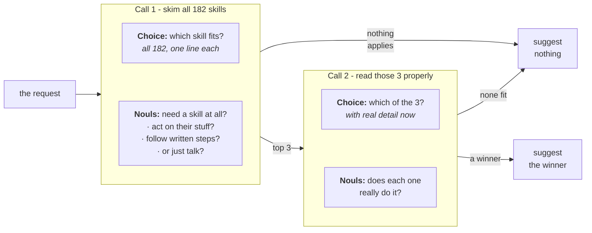

# 技能推荐

> 从 Nous Research Hermes 目录的 182 个技能中，为一次智能体回合最多挑出一个技能，全程用两次 TypeSafe 请求对候选先排序、再复核。

*智能体挑选技能的做法，是把所有技能截断后一股脑塞进系统消息，这既抬高成本、拖累技能选择的准确率，还会让本次会话后续的上下文逐渐腐化。这里改用每回合两次 TypeSafe 请求：一次给技能排序，一次复核选择结果，把错误的技能加载减少一半以上。*

技能清单一长，智能体几乎是凭零信息在做选择。清单以索引的形式到达它手里：每个技能一行，描述被截断，免得全文挤占对话。这里用的智能体框架 Hermes 默认截到 60 个字符。举例来说，在这么窄的宽度下，*编辑* `.pptx` 文件的技能，读起来和*创作*它的技能几乎一样。让它做一份路演稿，它可能加载错的那个。而在压根没有合适技能的回合，它照样可能加载一个，因为一列名字就是在引诱人去猜。

这个 cookbook 不动描述文本，改用渐进式披露：先廉价地读完 182 个技能，再细读其中三个。在「要不要加载技能、加载哪个」这个决定前面，放两次 TypeSafe 请求。第一次拿用户这一回合去给清单里每个技能排序，同时回答这一回合到底需不需要技能。第二次只重读前三名，此时带上每个技能的完整描述和其指令的开头，并且允许全盘否决。

胜出者的名字会作为额外的一行，进入智能体该回合的系统提示词：

```
<skill_relevance>
Relevant to the current request: pptx-author. Ignore this if it does not fit what the user
actually asked for.
</skill_relevance>
```

智能体仍然保留完整索引和自己的判断，那一行只告诉它先看哪一条。清单本身从不变化，因此基于它的前缀缓存依然有效。用 Hermes 清单里的技能，向 `claude-haiku-4-5-20251001` 发出 488 次请求：

|  | 加载了错误的技能 | 本无合适技能却仍加载 |
| --- | --- | --- |
| 只用清单的智能体 | 16.8% | 9.8% |
| **加了 TypeSafe 建议的智能体** | **7.3%** | **4.0%** |
| 直接拿到正确答案的智能体 | 2.5% | 1.2% |

第三行说明犯错的下限不是零：即便把正确的技能告诉智能体，它也不总会加载，再好的选择方法也跨不过这条线。

最终你会得到一个至多返回一个技能名的 `suggest()` 函数、一个把它包装成系统提示词片段的 `suggestion_block()`，以及生成上表的测试脚手架，可以直接指向你自己的清单。



## 环境准备

* 安装 TypeSafe 客户端、Anthropic 客户端，以及共享的 cookbook 辅助工具。
* 设置 [TypeSafe API key](https://console.typesafe.ai/keys)，并为被测智能体准备一个 Anthropic key。

```bash theme={null}
pip install anthropic matplotlib ipython 'cooksafe>=0.2.0,<0.3.0'
export TYPESAFE_API_KEY=your-key-here
export ANTHROPIC_API_KEY=your-key-here
```

> **注意：** 下面的代码块是同一个脚本，按顺序排列。要跟着跑一遍，就按这里给出的顺序放进同一个文件。

## 缓存结果

`JsonCache` 以输入为键保存每次调用的结果，因此重跑时直接复现下面的数字，不会再调用任何一个 API。删掉 `json_cache.json` 即可实际运行。本页发布的运行使用 `jev-1.12` 和 `claude-haiku-4-5-20251001`，渲染于 2026-07-31。

```python expandable theme={null}
import json
import os
from collections import defaultdict
from concurrent.futures import ThreadPoolExecutor
from pathlib import Path
from time import perf_counter

import anthropic
import matplotlib
import matplotlib.pyplot as plt
from matplotlib.ticker import PercentFormatter
from cooksafe import JsonCache, make_playground_link
from IPython.display import Markdown, display
from typesafe_sdk import Choice, Noul, TypeSafeClient

matplotlib.use("Agg")  # headless render

TYPESAFE_MODEL = "jev-1.12"
AGENT_MODEL = (
    "claude-haiku-4-5-20251001"  # the agent under test, pinned so scores are stable
)

SHORTLIST = 3  # candidates carried from the first request into the second
EXCERPT_CHARS = (
    700  # SKILL.md characters each candidate brings; the roster file stores 1600
)
GATE_THRESHOLD = (
    0.30  # mean of the three request nouls, below which nothing is suggested
)
FITS_THRESHOLD = (
    0.30  # a shortlist whose best "does this fit" noul is under this is dropped
)
WORKERS = 8  # small pool: enough to keep a live run to minutes, gentle on rate limits

assert EXCERPT_CHARS <= 1600, (
    "the shipped roster file stores 1600 body characters per skill"
)

client = TypeSafeClient(
    api_key=os.environ.get(
        "TYPESAFE_API_KEY", "cache-only"
    ),  # keyless kernels replay the cache
    base_url=os.environ.get("TYPESAFE_ENDPOINT"),
    timeout=120.0,
)
agent = anthropic.Anthropic(api_key=os.environ.get("ANTHROPIC_API_KEY", "cache-only"))
json_cache = JsonCache(Path("json_cache.json"))
```

## 第 1 步：加载技能清单

`hermes_roster.json` 保存 [NousResearch/hermes-agent](https://github.com/NousResearch/hermes-agent)（MIT）固定在某一个提交上的 182 个技能。每条记录包含技能名与分类、索引里显示的那段描述、完整描述，以及 `SKILL.md` 的开头部分。

下面的索引，以及提示词里位于它上方的那段指令，都照抄自 Hermes。

```python expandable theme={null}
ROSTER = json.loads(Path("hermes_roster.json").read_text(encoding="utf-8"))
BY_NAME = {skill["name"]: skill for skill in ROSTER}

# Verbatim from hermes-agent agent/prompt_builder.py:build_skills_system_prompt.
PREAMBLE = (
    "## Skills (mandatory)\n"
    "Before replying, scan the skills below. If a skill matches or is even partially relevant "
    "to your task, you MUST load it with skill_view(name) and follow its instructions. "
    "Err on the side of loading — it is always better to have context you don't need "
    "than to miss critical steps, pitfalls, or established workflows. "
    "Skills contain specialized knowledge — API endpoints, tool-specific commands, "
    "and proven workflows that outperform general-purpose approaches. Load the skill "
    "even if you think you could handle the task with basic tools like web_search or terminal. "
    "Skills also encode the user's preferred approach, conventions, and quality standards "
    "for tasks like code review, planning, and testing — load them even for tasks you "
    "already know how to do, because the skill defines how it should be done here.\n"
    "Whenever the user asks you to configure, set up, install, enable, disable, modify, "
    "or troubleshoot Hermes Agent itself — its CLI, config, models, providers, tools, "
    "skills, voice, gateway, plugins, or any feature — load the `hermes-agent` skill "
    "first. It has the actual commands (e.g. `hermes config set …`, `hermes tools`, "
    "`hermes setup`) so you don't have to guess or invent workarounds.\n"
    "If a skill has issues, fix it with skill_manage(action='patch').\n"
    "After difficult/iterative tasks, offer to save as a skill. "
    "If a skill you loaded was missing steps, had wrong commands, or needed "
    "pitfalls you discovered, update it before finishing.\n"
    "\n"
)
FOOTER = "\n\nOnly proceed without loading a skill if genuinely none are relevant to the task."
IDENTITY = (
    "You are Hermes, a capable AI assistant with access to tools and a library "
    "of skills. You help the user with coding, research, and everyday tasks.\n\n"
)


def render_index() -> str:
    """The body of <available_skills>: skills grouped by category, both sorted by name."""
    by_category = defaultdict(list)
    for skill in ROSTER:
        by_category[skill["category"]].append(skill)
    lines = []
    for category in sorted(by_category):
        lines.append(f"  {category}:")
        for skill in sorted(by_category[category], key=lambda s: s["name"]):
            lines.append(f"    - {skill['name']}: {skill['description']}")
    return "\n".join(lines)


CATALOG_PROMPT = (
    IDENTITY
    + PREAMBLE
    + "<available_skills>\n"
    + render_index()
    + "\n</available_skills>"
    + FOOTER
)

widths = [len(skill["description"]) for skill in ROSTER]
print(f"{len(ROSTER)} skills in {len({s['category'] for s in ROSTER})} categories")
print(f"roster prompt: {len(CATALOG_PROMPT):,} characters")
print(
    f"index description: {sum(widths) / len(widths):.0f} characters on average, "
    f"{max(widths)} at most"
)
print("\none category, as the agent reads it:")
index_lines = render_index().splitlines()
start = index_lines.index("  apple:")
end = next(
    i
    for i in range(start + 1, len(index_lines))
    if not index_lines[i].startswith("    ")
)
print("\n".join(index_lines[start:end]))
```

```
182 skills in 33 categories
roster prompt: 16,089 characters
index description: 54 characters on average, 60 at most

one category, as the agent reads it:
  apple:
    - apple-notes: Manage Apple Notes via memo CLI: create, search, edit.
    - apple-reminders: Apple Reminders via remindctl: add, list, complete.
    - findmy: Track Apple devices/AirTags via FindMy.app on macOS.
    - imessage: Send and receive iMessages/SMS via the imsg CLI on macOS.
```

## 第 2 步：先测智能体单干的表现

`requests.json` 里有 488 条单回合请求，其中 315 条恰好对应一个技能，另外 173 条不对应任何技能。

有对应技能的请求由 Claude Sonnet 5 依据各技能的 `SKILL.md` 写出，因此标注可信，而且比用户真实发来的请求更容易。

173 条无对应技能的请求都是为了惩罚瞎猜而写的：85 条日常请求、42 条没有技能能胜任的技术问题（*解释一下什么是 monad*），以及 46 条要求清单里根本没有的技能才能完成的具体任务，比如在只覆盖 X、别的什么都没有的清单上要求*把这条内容发到 Mastodon*。

评分只看智能体的第一次响应。两个指标都是错误率，因此都越低越好：

* **错误加载（wrong load）**：在有对应技能的请求中，第一次 `skill_view` 调用不是该技能的比例。整个回合什么都没加载也算一次失败。
* **多余加载（needless load）**：在无对应技能的请求中，智能体调用了 `skill_view` 的比例。

```python theme={null}
REQUESTS = json.loads(Path("requests.json").read_text(encoding="utf-8"))
POSITIVES = [p for p in REQUESTS if p["gold"]]
NEGATIVES = [p for p in REQUESTS if not p["gold"]]

print(
    f"{len(REQUESTS)} requests: {len(POSITIVES)} covered by a skill "
    f"({len({p['gold'] for p in POSITIVES})} distinct skills), {len(NEGATIVES)} covered by none"
)
print(f"\ncovered   [{POSITIVES[0]['gold']}]  {POSITIVES[0]['text']}")
print(f"uncovered  {NEGATIVES[0]['text']}")
```

```
488 requests: 315 covered by a skill (171 distinct skills), 173 covered by none

covered   [1password]  I've got a config.yaml with `{{ op://app-prod/db/password }}` placeholders in it — can you set up my project to pull the real values in at runtime instead of hardcoding them?
uncovered  Add these three cards to our Trello backlog.
```

建议放在系统提示词里独立的一块，位于清单之后而不是嵌进清单里；这样清单文本在每个回合都完全相同，前缀缓存才能保持有效。

智能体的工具集很小，其中包括用自由文本技能名加载技能的 `skill_view`。名字必须与技能完全一致，加载才算正确。

```python expandable theme={null}
# Verbatim from hermes-agent tools/skills_tool.py:SKILL_VIEW_SCHEMA.
SKILL_VIEW_DESCRIPTION = (
    "Skills allow for loading information about specific tasks and workflows, as "
    "well as scripts and templates. Load a skill's full content or access its "
    "linked files (references, templates, scripts). First call returns SKILL.md "
    "content plus a 'linked_files' dict showing available references/templates/"
    "scripts. To access those, call again with file_path parameter."
)
TOOLS = [
    {
        "name": "skill_view",
        "description": SKILL_VIEW_DESCRIPTION,
        "input_schema": {
            "type": "object",
            "properties": {
                "name": {"type": "string", "description": "The skill name."}
            },
            "required": ["name"],
        },
    },
    {
        "name": "terminal",
        "description": "Run a shell command on the user's machine and return its output.",
        "input_schema": {
            "type": "object",
            "properties": {"command": {"type": "string"}},
            "required": ["command"],
        },
    },
    {
        "name": "read_file",
        "description": "Read a file from the user's filesystem.",
        "input_schema": {
            "type": "object",
            "properties": {"path": {"type": "string"}},
            "required": ["path"],
        },
    },
    {
        "name": "web_search",
        "description": "Search the web and return result snippets.",
        "input_schema": {
            "type": "object",
            "properties": {"query": {"type": "string"}},
            "required": ["query"],
        },
    },
]


@json_cache
def run_turn(model: str, arm: str, request: str, suggestion: str) -> dict:
    """One measured turn. ``arm`` is in the key so each arm samples independently."""
    system = [
        {"type": "text", "text": CATALOG_PROMPT, "cache_control": {"type": "ephemeral"}}
    ]
    if suggestion:
        system.append({"type": "text", "text": suggestion})  # after the breakpoint
    response = agent.messages.create(
        model=model,
        max_tokens=1024,
        system=system,
        tools=TOOLS,
        messages=[{"role": "user", "content": request}],
    )
    usage = response.usage
    return {
        "loaded": [
            str(block.input.get("name", ""))
            for block in response.content
            if block.type == "tool_use" and block.name == "skill_view"
        ],
        "input_tokens": usage.input_tokens or 0,
        "output_tokens": usage.output_tokens or 0,
    }


def summarise(turns: dict[str, dict]) -> dict[str, float]:
    """Two failure rates: wrong loads on covered requests, needless ones on uncovered."""
    hits = [turns[p["text"]]["loaded"][:1] == [p["gold"]] for p in POSITIVES]
    over = [bool(turns[p["text"]]["loaded"]) for p in NEGATIVES]
    return {
        # both metrics are errors, so the two columns read the same direction
        "wrong_load": 1 - sum(hits) / len(hits),
        "needless_load": sum(over) / len(over),
    }


def run_arm(arm: str, suggestions: dict[str, str]) -> dict[str, dict]:
    """One measured turn per request, in a small pool. 488 calls."""
    texts = [request["text"] for request in REQUESTS]
    with ThreadPoolExecutor(max_workers=WORKERS) as pool:
        turns = pool.map(
            lambda t: run_turn(AGENT_MODEL, arm, t, suggestions.get(t, "")), texts
        )
        return dict(zip(texts, turns))
```

先让智能体只带清单跑一遍，也就是它今天的做法。它的两个错误率就是本 cookbook 余下部分用来对照的基线。

```python theme={null}
baseline = run_arm("baseline", {})
base_scores = summarise(baseline)
print(
    f"wrong loads    {base_scores['wrong_load']:.1%}   ({len(POSITIVES)} covered requests)"
)
print(
    f"needless loads {base_scores['needless_load']:.1%}   ({len(NEGATIVES)} uncovered requests)"
)

# where the wrong loads land: a neighbour of the right skill, or somewhere unrelated?
misses = [
    (p["gold"], baseline[p["text"]]["loaded"][0])
    for p in POSITIVES
    if baseline[p["text"]]["loaded"] and baseline[p["text"]]["loaded"][0] != p["gold"]
]
same_category = sum(
    1
    for gold, got in misses
    if got in BY_NAME and BY_NAME[got]["category"] == BY_NAME[gold]["category"]
)
print(
    f"\nof {len(misses)} wrong first picks, {same_category} came from the right skill's own "
    f"category"
)
```

```
wrong loads    16.8%   (315 covered requests)
needless loads 9.8%   (173 uncovered requests)

of 36 wrong first picks, 10 came from the right skill's own category
```

错误加载落在正确技能自己所属分类里的次数远高于随机概率，可见难处在于把几个长得很像的技能区分开。智能体大致已经找对地方了。

## 第 3 步：给整份清单排序

一次请求里带两类问题：

* **`which`** 是一个 [`Choice`](/primitives/choice) 问题，覆盖全部 182 个技能名，以索引里的描述作为每个选项的判据（就是智能体自己看到的那段文字）。它的概率分布就是排序结果。
* **三个关于这次请求的 [`Noul`](/primitives/noul) 问题**，列在下面，各自换一种问法，判断要的是动手做事还是只要解释。`prose_suffices` 的方向相反。三者的均值决定要不要给出任何建议，低于 0.30 就什么都不建议。

两类问题在同一次请求里发出，排序和检查只花一个来回。

写这三个问题时，要问的是「是否要求动手」。问主题内容没用：*解释一下什么是 monad* 和真正需要技能的请求都是软件话题，分不开。

一个 `Choice` 问题装下这个规模的清单毫无压力。再大上几倍，就得把它切成几块分别排序，然后对胜出者跑同样的候选列表步骤。

```python expandable theme={null}
CHOICE_INSTRUCTIONS = (
    "Which of these skills, if any, is the right one to load to help with the "
    "user's latest request?"
)
GATE_QUESTIONS = {
    "acts_on_user_system": (
        "Is the assistant being asked to act on the user's files, accounts, devices, "
        "or online services, rather than only to explain or advise?"
    ),
    "would_follow_documented_procedure": (
        "Would a careful expert answering this consult a specific documented procedure "
        "or set of commands, rather than answering from general understanding?"
    ),
    "prose_suffices": (
        "Could a knowledgeable generalist fully satisfy this request in prose, with "
        "no tools, no documentation, and no access to the user's files or accounts?"
    ),
}
INVERTED = {"prose_suffices"}  # a yes here points away from needing a skill


def build_state(request: str) -> dict:
    return {"request": request, "recent_context": ""}


@json_cache
def rank_wide(request: str) -> dict:
    """Request 1: rank all 182 skills, and score the request for whether a skill applies."""
    questions = {
        "which": Choice(
            instructions=CHOICE_INSTRUCTIONS,
            criteria={skill["name"]: skill["description"] for skill in ROSTER},
        )
    }
    for key, text in GATE_QUESTIONS.items():
        questions[f"gate::{key}"] = Noul(instructions=text)
    started = perf_counter()
    response = client.system_one(
        state=build_state(request), questions=questions, model=TYPESAFE_MODEL
    )
    ranked = sorted(
        response.answers["which"].probabilities.items(), key=lambda kv: -kv[1]
    )
    values = {
        key.removeprefix("gate::"): answer.noul
        for key, answer in response.answers.items()
        if key.startswith("gate::")
    }
    oriented = [(1.0 - v) if k in INVERTED else v for k, v in values.items()]
    return {
        "ranked": ranked[
            :12
        ],  # more than any shortlist needs, and keeps the cache small
        "gate": sum(oriented) / len(oriented),
        "values": values,
        "seconds": round(perf_counter() - started, 2),
        "input_tokens": response.usage.input_tokens or 0,
        "output_tokens": response.usage.output_tokens or 0,
    }


DEMO = [
    "Can you save this recipe as a new note in my 'Recipes' folder in Notes.app so it syncs"
    " to my phone? Just write it up in whatever editor pops up.",
    "Can you put together a pitch deck skeleton (cover, situation overview, comps, precedent"
    " transactions, DCF, LBO) as a .pptx, using our firm-template.pptx for branding and"
    " footnoting each valuation number back to the cell it came from in the model?",
    "Post this announcement to my Mastodon account.",
]
for request in DEMO:
    wide = rank_wide(request)
    verdict = "suggest" if wide["gate"] >= GATE_THRESHOLD else "stay quiet"
    print(f'"{request[:78]}"')
    print(f"  needs a skill {wide['gate']:.2f} -> {verdict}   ({wide['seconds']}s)")
    for name, probability in wide["ranked"][:SHORTLIST]:
        print(f"    {probability:.3f}  {name:<38}{BY_NAME[name]['description']}")
    print()
```

```
"Can you save this recipe as a new note in my 'Recipes' folder in Notes.app so "
  needs a skill 0.75 -> suggest   (0.31s)
    0.990  apple-notes                           Manage Apple Notes via memo CLI: create, search, edit.
    0.010  computer-use                          Drive the user's desktop in the background — clicking, ty...
    0.000  concept-diagrams                      Generate flat, minimal educational SVG visuals as HTML.

"Can you put together a pitch deck skeleton (cover, situation overview, comps, "
  needs a skill 0.76 -> suggest   (0.16s)
    0.700  powerpoint                            Create, read, edit .pptx decks, slides, notes, templates.
    0.300  pptx-author                           Build PowerPoint decks headless with python-pptx.
    0.000  chroma                                Embedding database for RAG and semantic search.

"Post this announcement to my Mastodon account."
  needs a skill 0.78 -> suggest   (0.16s)
    0.550  xurl                                  X/Twitter via xurl CLI: raw post search, posting, DM, media.
    0.140  computer-use                          Drive the user's desktop in the background — clicking, ty...
    0.080  openhands                             Delegate coding to OpenHands CLI (model-agnostic, LiteLLM).
```

Notes.app 那条请求毫不含糊，排在第一的选项就是对的。Mastodon 那条则无解：三个问题都判为需要技能，因为往账号里发东西确实是个动作；清单里有发 X 的技能、没有发 Mastodon 的，最接近的那个技能照样会赢。

剩下的是那份路演稿。领先的两个都是 `.pptx` 技能，而在 60 个字符的宽度下，面对一份创作路演稿的请求，宽范围 Choice 问题把编辑技能排在了创作技能前面。

## 第 4 步：重排前三名

三个选项就容得下完整描述，再加各技能 `SKILL.md` 的开头，于是第二次请求把同样的问题摆到更好的证据面前：

* **`which`** 是针对候选列表的 `Choice` 问题，以那段更长的文字作为每个选项的判据。
* **`fits::{name}`** 是每个候选一个 `Noul` 问题：这个技能真的能做请求要的那件具体事吗？它们各自独立作答，因此可能全都给低分；候选列表里最高的一个低于 0.30，整份列表就被丢掉。

```python expandable theme={null}
RERANK_INSTRUCTIONS = (
    "Exactly one of these skills is the right one to load for the user's latest "
    "request. Which one? Read what each actually does, not just its name."
)


def rerank_criteria(names: tuple[str, ...], excerpt: int) -> dict[str, str]:
    return {
        name: f"{BY_NAME[name]['description_full']} — {BY_NAME[name]['body'][:excerpt]}"
        for name in names
    }


def rerank_questions(names: tuple[str, ...], excerpt: int) -> dict:
    questions = {
        "which": Choice(
            instructions=RERANK_INSTRUCTIONS, criteria=rerank_criteria(names, excerpt)
        )
    }
    for name in names:
        questions[f"fits::{name}"] = Noul(
            instructions=(
                f"Does the skill '{name}' do the specific thing the user's request asks "
                f"for? It is described as: {BY_NAME[name]['description_full']}"
            )
        )
    return questions


@json_cache
def rerank(request: str, names: tuple[str, ...], excerpt: int) -> dict:
    """Request 2: the same Choice over a shortlist, plus one absolute noul per candidate."""
    started = perf_counter()
    response = client.system_one(
        state=build_state(request),
        questions=rerank_questions(names, excerpt),
        model=TYPESAFE_MODEL,
    )
    return {
        "winner": response.answers["which"].choice,
        "fits": {
            key.removeprefix("fits::"): answer.noul
            for key, answer in response.answers.items()
            if key.startswith("fits::")
        },
        "seconds": round(perf_counter() - started, 2),
        "input_tokens": response.usage.input_tokens or 0,
        "output_tokens": response.usage.output_tokens or 0,
    }


for request in DEMO:
    wide = rank_wide(request)
    if wide["gate"] < GATE_THRESHOLD:
        print(f'"{request[:78]}"\n  scored too low, nothing suggested\n')
        continue
    shortlist = tuple(name for name, _ in wide["ranked"][:SHORTLIST])
    result = rerank(request, shortlist, EXCERPT_CHARS)
    best = max(result["fits"].values())
    verdict = result["winner"] if best >= FITS_THRESHOLD else "nothing fits"
    print(f'"{request[:78]}"')
    print(f"  was {shortlist[0]} -> {verdict}   ({result['seconds']}s)")
    for name in shortlist:
        print(f"    fits {result['fits'][name]:.2f}  {name}")
    print()
```

```
"Can you save this recipe as a new note in my 'Recipes' folder in Notes.app so "
  was apple-notes -> apple-notes   (0.12s)
    fits 0.60  apple-notes
    fits 0.54  computer-use
    fits 0.01  concept-diagrams

"Can you put together a pitch deck skeleton (cover, situation overview, comps, "
  was powerpoint -> pptx-author   (0.09s)
    fits 0.73  powerpoint
    fits 0.38  pptx-author
    fits 0.02  chroma

"Post this announcement to my Mastodon account."
  was xurl -> xurl   (0.09s)
    fits 0.56  xurl
    fits 0.38  computer-use
    fits 0.05  openhands
```

两个 `.pptx` 技能一旦各自带上自己的文本就分开了：这份路演稿请求翻转到了创作技能上。

`fits` 的 noul 和 Choice 在那里结论不一致：noul 给编辑技能的分更高，Choice 却挑了创作技能。它们决定的是不同的事——Choice 定的是*哪一个*技能，noul 定的是到底*要不要*开口。

Mastodon 那条请求两轮检查都过了：它最好的 `fits` noul 高于 0.30，于是这套做法为一条关于 Mastodon 的请求推荐了 X 技能。这类请求大多数会被拦下。第二轮只能否决宽范围排序交上来的东西，而这次交上来的是三个差一点就被否掉的候选。

下面的函数就是全部做法：两次请求、两个阈值，最多返回一个技能名。

要把它指向你自己的清单，替换 `hermes_roster.json` 即可。上面每个问题都只从该文件读取 `name`、`description`、`description_full` 和 `body`，其余代码对 Hermes 一无所知。

```python theme={null}
def suggest(request: str) -> tuple[str, ...]:
    """At most one skill name for a request, or () for "nothing here applies"."""
    wide = rank_wide(request)
    if wide["gate"] < GATE_THRESHOLD:
        return ()
    shortlist = tuple(name for name, _ in wide["ranked"][:SHORTLIST])
    result = rerank(request, shortlist, EXCERPT_CHARS)
    if max(result["fits"].values()) < FITS_THRESHOLD:
        return ()
    return (result["winner"],)


def suggestion_block(names: tuple[str, ...]) -> str:
    """What gets appended after the roster, in the suggestion.

    This string is a measured input rather than prose: it goes to the agent, so it is part
    of every graded turn's cache key. Editing a word here silently invalidates the shipped
    results and costs a live re-run to restore them.
    """
    body = (
        f"Relevant to the current request: {', '.join(names)}. Ignore this if it does not "
        "fit what the user actually asked for."
        if names
        else "No skill in the roster appears relevant to this request."
    )
    return f"\n\n<skill_relevance>\n{body}\n</skill_relevance>"


print(suggestion_block(suggest(DEMO[1])))
print(suggestion_block(suggest(DEMO[2])))
```

```


<skill_relevance>
Relevant to the current request: pptx-author. Ignore this if it does not fit what the user actually asked for.
</skill_relevance>


<skill_relevance>
Relevant to the current request: xurl. Ignore this if it does not fit what the user actually asked for.
</skill_relevance>
```

## 第 5 步：测量建议的效果

488 条请求各跑三次，每次记录一个回合。三轮的差别只在于告诉智能体什么：

|  | 系统提示词里放了什么 |
| --- | --- |
| 智能体单干 | 什么都不放 |
| 智能体拿到建议 | `suggest()` 返回的内容 |
| 智能体直接得到答案 | 对应技能的名字；没有对应技能时是 "nothing applies" |

第三轮在实际中做不到，它是另外两轮用来对标的天花板。

那句建议的措辞承担两项工作。一是说明建议可以忽略：施加更大压力固然能让错误建议也被采纳，但错误的建议比没有更糟。二是即使这一回合没有任何可推荐的技能，也仍然会发一句话讲明；要是什么都不发，清单自带的 "err on the side of loading" 指令就没人制衡了。

```python expandable theme={null}
texts = [request["text"] for request in REQUESTS]
with ThreadPoolExecutor(max_workers=WORKERS) as pool:  # up to 488 x 2 TypeSafe requests
    suggested = dict(zip(texts, pool.map(suggest, texts)))
WIDE = {text: rank_wide(text) for text in texts}  # all cache hits now; reused below

arms = {
    "baseline": {},
    "TypeSafe": {
        request["text"]: suggestion_block(suggested[request["text"]])
        for request in REQUESTS
    },
    "oracle": {
        request["text"]: suggestion_block((request["gold"],) if request["gold"] else ())
        for request in REQUESTS
    },
}
scores = {
    arm: summarise(run_arm(arm, suggestions)) for arm, suggestions in arms.items()
}

print(f"{'run':<10}{'wrong loads':>13}{'needless loads':>16}")
for arm, row in scores.items():
    print(f"{arm:<10}{row['wrong_load']:>13.1%}{row['needless_load']:>16.1%}")


def fewer(metric: str) -> str:
    """The plain ratio between the two arms' error rates."""
    return f"{scores['baseline'][metric] / scores['TypeSafe'][metric]:.1f}x fewer"


print(
    f"\nbaseline -> TypeSafe:  {fewer('wrong_load')} wrong loads, "
    f"{fewer('needless_load')} needless ones"
)
```

```
run         wrong loads  needless loads
baseline          16.8%            9.8%
TypeSafe           7.3%            4.0%
oracle             2.5%            1.2%

baseline -> TypeSafe:  2.3x fewer wrong loads, 2.4x fewer needless ones
```

```python theme={null}
moved = [
    (
        baseline[p["text"]]["loaded"][:1] == [p["gold"]],
        run_turn(AGENT_MODEL, "TypeSafe", p["text"], arms["TypeSafe"][p["text"]])[
            "loaded"
        ][:1]
        == [p["gold"]],
    )
    for p in POSITIVES
]
print(
    f"of {len(POSITIVES)} covered requests: {sum(not b and a for b, a in moved)} the suggestion "
    f"fixed, {sum(b and not a for b, a in moved)} it broke"
)
```

```
of 315 covered requests: 37 the suggestion fixed, 7 it broke
```

建议修正的请求远多于它弄错的请求，但它确实会弄错一些智能体本来答对的请求。一条自信的错误建议，比没有建议更能把智能体带偏——这就是把建议摆到回合前面的代价。

```python expandable theme={null}
SURFACE, INK, INK2, MUTED = "#fcfcfb", "#0b0b0b", "#52514e", "#898781"
GRID, AXIS, BLUE, ORANGE = "#e1e0d9", "#c3c2b7", "#2a78d6", "#eb6834"

ARM_COLOR = {"baseline": BLUE, "TypeSafe": ORANGE, "oracle": MUTED}


def style(ax):
    ax.set_facecolor(SURFACE)
    for side in ("top", "right"):
        ax.spines[side].set_visible(False)
    for side in ("left", "bottom"):
        ax.spines[side].set_color(AXIS)
    ax.tick_params(colors=MUTED, labelcolor=INK2, labelsize=9)
    ax.set_axisbelow(True)


panels = [
    ("wrong_load", f"wrong loads\n{len(POSITIVES)} covered requests"),
    ("needless_load", f"needless loads\n{len(NEGATIVES)} uncovered requests"),
]
names = list(scores)
fig, axes = plt.subplots(1, 2, figsize=(8.4, 3.6), facecolor=SURFACE)
for ax, (metric, title) in zip(axes, panels):
    style(ax)
    ax.grid(axis="y", color=GRID, linewidth=0.8)
    values = [scores[arm][metric] for arm in names]
    bars = ax.bar(
        names,
        values,
        0.58,
        color=[ARM_COLOR[arm] for arm in names],
        # the oracle is a ceiling, not a competitor: gray, and hatched so it never depends
        # on colour alone
        hatch=["", "", "///"],
        edgecolor=SURFACE,
        linewidth=1.2,
    )
    ax.bar_label(
        bars,
        labels=[f"{v:.1%}" for v in values],
        padding=3,
        color=INK2,
        fontsize=9,
    )
    ax.set_title(title, loc="left", color=INK2, fontsize=9.5)
    ax.set_ylim(0, max(values) * 1.28)
    ax.yaxis.set_major_formatter(PercentFormatter(xmax=1, decimals=0))
    ax.set_ylabel("% of those requests - lower is better", color=INK2, fontsize=9)
fig.suptitle(
    f"Hermes' {len(ROSTER)}-skill roster, {len(REQUESTS)} requests, {AGENT_MODEL}",
    x=0.02,
    ha="left",
    color=INK,
    fontsize=11,
)
fig.tight_layout()
display(fig)
plt.close(fig)
```


## 结果说明了什么

* 错误加载从 16.8% 降到 7.3%，多余加载从 9.8% 降到 4.0%，基本填上了「照截断索引瞎猜」与「直接拿到答案」之间的大部分差距。
* 有些智能体本来答对的请求，一旦附上建议反而错了。数量见上文。

当你的智能体背着大清单时，照搬这套做法：先对整个清单做一次廉价排序，再细看两三个。两步都可能空手而归。

## 在 TypeSafe playground 中打开

为第 4 步里的那份路演稿请求生成一个 Playground 链接，以每个候选的完整描述和正文摘录作为判据。

```python theme={null}
demo_shortlist = tuple(name for name, _ in rank_wide(DEMO[1])["ranked"][:SHORTLIST])
playground_link = make_playground_link(
    build_state(DEMO[1]),
    rerank_questions(demo_shortlist, EXCERPT_CHARS),
    models=[TYPESAFE_MODEL],
)
display(
    Markdown(
        f"🔗 [Open the shortlist + questions in the TypeSafe playground]({playground_link})"
    )
)
```

<a href="https://console.typesafe.ai/playground#share/N4IgJg9gxgrgtgUwHYBcAqCAeKQC4AEIwAOiAE4ICOMCAziqQaQMICGS+AnhDPgA4wU+FBADmCFAAsEZfK34BLFFEn4wCKAGt8tTQgA2EiBwAUUCADcZAGh1KYrFAuP5LMiwoQB3W+bh9aWz4KKAR1VGEydlpWKCdjQPwAEWYAMVsAGQAhAHkASjlaOXwAOj4+FExbGFoFJFFXGFkAMwUyOABaFAR-fUcEMorMfGaIWQAjKKQwOob2MBGICBQkZdn8BFjVC1Z9B3iOJHhxmXxx2O0RYWl8UP19fCVb1kQRsgg4R44pBHw4CHU+gA-KRbKQQsgUAB9cyoLAMPD4UikAC+IFsIGCHwqtAw2ERRFIXkkChUjHwJBAKE4fAQ5NIKggpLp6KRIDq9DIMDiziQtHpIAAophYih9JxXEhfhBmtc6L9dAp7kUFEUfvgyApRJIhMZfld9BBWAtRrJ1TUZAByIp9br0DVUGj0Er4ADqJJUkoQQPwACVNgtiY4Nls5HEHPcJZA6LZVkIAFY1IRKIpIF4DUFsqCa7qa1jkyl8CBeGRFuoIpggZgUfq2GtgWxhJ6DSpqDSaRK0fQKdSJOMx4Q9Pi2uguwAoBPgAMT4AAKxdLTIiAGVNEqHtXNt06wHbPMNjMhHOS2Q5+W21oihPmu9OrRs45PeIpVEDvgvEpVOVKk-44lur1+g6c5aDCfclHWDx5BmEIhAADQAWQyP52AUARbV5WxaFpVg9FkftEhUVgyBQRI917LUOAARQAQRdaj8AAAxbTAGMeIp5AALQASRnOQyBUBQrFcWUEKQ1pDFoF1J2nd1kGECB8AAVRApSVKkVUdFXe45CQCUnFeeRmNcWQymWYZxN+DS6gsCB9CsBY6h0iUvFYCUJ1YFUkAEFBbB4FBvN8iZlkkAhs03dYux7X51AvIIlE9GKO0C-gKBA1BHF5WgAG4HWNdYxg2bAoh5epB2wN4Pic0ov0wHKmycUqsFVBqGmCeV0oObLbg+cY6ny2QsO7FAWp0bt1BGJU6ByrwxlXUr3ykQcALtfATFMyo8lsPpuEETtsNw-B8OSvxEFQST8DQTVRHEWRiWQBArDNG4LVkU7OqRYhSES6xPtID7SEi3sfs+kB-sxVLIQy4xgb+gqKGaGRkFCdjqqGAB6dbzMmtNECk6cZwoChqFVJQWTBTEhg6VhBEkMYBSyGAlQWI8ZFPCJEqKaRjQkooFs-TgpGMDoavHKd+Ep6nBdkAmAW5X5DJqibDElNRVW0Gp1gYvgBdppBhaGJjVN+O6OB2w6EFAq5AUE04oPbQpigsvinGaUVY2WNRNSE+RuyElmT0XIQQNoWpjDosBWAqUDr0q6jUEkd4+FJa1GJqqmabGVi9y1+LJA6RLWMVZUvnwABtdgpET0laDR1o0yQKAFF2DoQLIDxkYAXRMHV-NoXA0bR0QPxgcYSj8NGK4TiAk6gGu6-YRvm9b9u6DyF00BueDmF4tH8ByZpWlCDoACklzOKYVDoYS5WMrU6l2diKE96faQWCd1PYkP4CvrmwB52cdZh3wKkAq6pJhGnUGQXc+h6ycBbiScooF-ZsyEJLWmmpSpFweCYQGA4sKbAOkdDYcAThgESIgGYrBNo6AtjfcYjN9AoA6I5LW84yBllQIXLS+h14kiKFgtixRuzalzB0EsWodT8EcLmb4MApQmgKv8QEQELigQ5qtJOyhVAc1sFxZgfwegQESJsMgSBZipmWKvN80gn4PRkBKI4JDThwCTJEWI+oFLyFoDwfixtZrjCWJoPGe9BB8EzAyKecB8yIlIIKJxYAZilQjigVgwFfimj9NRAA4jpBYIEomoFJDQoiKhRbTmYJE+QHQ960j1kuHxoR8BxNIYkhoSRHCpI8r8DevxqJcQ6GmJwQlkmdJUhk+hTN1gZAyPBOQ5RuxQChnyN8H4DH-DIJwYJslvgKQtPgCpN55AACojnKV+Acj48gTa4BOfgapDNJmlV9Nk1aFAUCages3amog3qgSfDIJZBRI7DlJEsoo1SAByFsFiGkWfoNGIF9DNA6LTegoErBxAKiMtJdy3QV1cLUluDSFS2UELyVa1E+BbF+AAJhKAABgKNUmWIhqRJ1Ko5fsASIAdlxUuHoFcikgRKaoNwshICwDeuC-AS4RAYIaD0Fp5iVmLUQCkkZ+ATnwQkJqWeJyCDVJOTSgALNYAAzPS+lABqfAWSlAAAkR46BSWQWgtzDVHIAIzWAAJyWptaaDs7rNVHIsJ6koZqI23JwSk8YhhbAlgQJocUDpDBdNoEykNlLqX4DpfS-ACzkAgVuScs5chGEyEGTbTyaLjT6txScmcdQNB6nrfBdgrBxALCgIaGADY5CCAgC3OF6wPWpD6UuJc9aZxNAVAoOASoiJKAlMK-ikh3YGPVR0htRzXSbEgt0ad7wwDclfIhAZGVhkdJxR6yiYApgoHrfaiRbIUQonJq0EiuBcBFmPBwisFJSBspZJWVYMB9DhPZHyd5p7MoCiSBAK+6oBGWl-Qucslo1AKWQ7SRuh9rjrHNK3FORMnSoN0EUU0PouLJiKL2bMChSGFAIBuWsuV+31VRq2HRo0op9ksX+IcI5JKog-Smb9ac0F00RJSYDAowMQdZKQDkMGeQJHg4htUNwUOSYzmQTDkAb74Lw0U9SpUiNWiKKRug5HeVUfwDRwR9HNRMY8gQB5+hmZsJQeeXlv9-5834IAvWItRNsk-X3XAKhDkFiAzSEDbIFOQZU1yNTfINNIe09w-AlpouXIM9h7TuGFD4bMw0Cz+mrOOhs4UOzYxqO0bbHeFzoE3NNPia0tQ16umLFkM8nJe58mCqgMUtdJRURogxJHBQAA1GQockAEjDayEAiKNDdDAPBAEBhaCIlLiAeMD0Ojhs9TSkAHcURAA" target="_blank" rel="noreferrer" className="text-primary">在 TypeSafe playground 中打开这份候选列表及其问题 →</a>

## 接下来

同样的做法还出现在别处：[意图路由](/patterns/intent-routing) 把请求路由到处理器而不是技能，[置信度](/confidence) 用来挑上面那两个阈值，[推测性扇出](/patterns/fan-out) 则把所有问题塞进一次请求。
