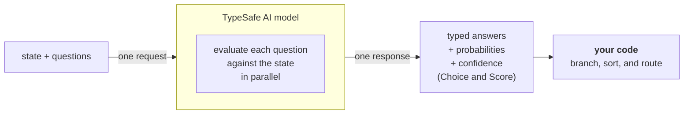

# 简介

> Jev 是 TypeSafe 的旗舰模型，也是第一个 System One 模型。发送状态（state）和带类型的问题（typed questions），即可获得代码可以直接使用的结构化答案。

大语言模型（LLM）是为生成供人类阅读的文本而设计的。当你需要模型做出一个由代码消费的判断时，就会产生错配：你是在强迫一个文本生成系统输出结构化决策，然后再把结果解析回代码可以依赖的东西。

Jev 是 TypeSafe 的旗舰模型，也是第一个 [System One 模型](/concepts/system-one)。System One 模型专为软件可以直接使用的快速、结构化决策而构建。Jev 依据类型化的*问题*（questions）对*状态*（state）进行评估，并直接返回结构化结果。没有文本生成，没有解析。你得到的是类型化的值和概率分布，代码可以基于它们进行分支、排序和路由。Choice 和 Score 还会返回[置信度](/confidence)，你的代码可以用它来决定是否以及如何根据答案采取行动。

## TypeSafe 原语

TypeSafe 提供三种 *AI 原语*。与软件原语类似，我们的 AI 原语是模块化、可组合、结构化、可靠且快速的。每种原语提出一种不同类型的*问题*，并返回一种不同类型的答案。

| 问题类型                        | 目标                    | 返回值                                    |
| ------------------------------ | ----------------------- | ---------------------------------------- |
| [Choice](/primitives/choice)   | 从列表中选择一个选项       | `choice`、`probabilities`、`confidence`  |
| [Score](/primitives/score)     | 按评分量规对状态打分       | `score`、`probabilities`、`confidence`   |
| [Noul](/primitives/noul)       | 这个陈述是否为真？         | `noul`（0–1）                            |

三种*问题*类型可以在一次 API 调用中混用。每个*问题*都会在同一次调用中并行、隔离地针对同一个*状态*进行评估。增加问题几乎不会改变响应时间。每个问题都是独立评估的，因此增加更多问题不会造成上下文腐烂（context-rot）。

## 原子化问题，在代码中组合

当每个问题只询问一个具体、范围明确的事情时，System One 模型表现最好。可以把每个问题想象成一次直觉式判定：一个知识渊博的人在给定恰当上下文的情况下，几秒钟内就能做出的那种判断。

如果你想问的问题需要 extended reasoning（扩展推理），或者需要权衡多个独立因素，就把它拆解。把每个因素作为单独的问题提问，然后在代码中用逻辑组合结果。这让每次单独的评估保持可靠，并让你完全控制各维度的权重。

例如，不要问"给这个创业路演评分"，而是分别询问市场规模、技术可行性和差异化。用你自己的公式组合这些分数。当优先级发生变化时，只需修改代码中的一个系数，而不是重写提示词。

## 下一步

* [快速开始](/introduction/quickstart)——立即上手所需的一切。
* [AI 入门](/introduction/machine-learning-primer)——为什么 TypeSafe 训练的是校准决策模型而不是文本生成模型。
* [原语（问题）](/primitives)——如何定义问题，在 Choice、Score 和 Noul 之间如何选择，以及如何一次提出多个问题。
* [置信度](/confidence)——TypeSafe 如何报告确定性，以及如何在架构上使用它。
* [模式](/patterns)——使用 TypeSafe 构建系统的常见模式。
