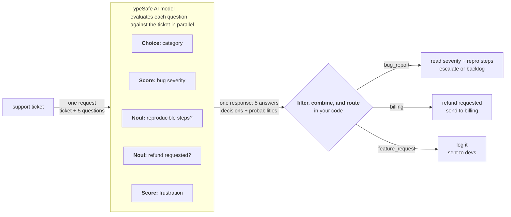

# 推测性扇出

> 在一次调用里发送多个问题（包括暂时用不上的），让代码自己判断哪些结果相关。

export function TypesafeExample({example, display, title}) {
  const keyStrUriSafe = "ABCDEFGHIJKLMNOPQRSTUVWXYZabcdefghijklmnopqrstuvwxyz0123456789+-$";
  function compressToEncodedURIComponent(input) {
    if (input == null) return "";
    return _compress(input, 6, function (a) {
      return keyStrUriSafe.charAt(a);
    });
  }
  function _compress(uncompressed, bitsPerChar, getCharFromInt) {
    if (uncompressed == null) return "";
    var i, value, context_dictionary = {}, context_dictionaryToCreate = {}, context_c = "", context_wc = "", context_w = "", context_enlargeIn = 2, context_dictSize = 3, context_numBits = 2, context_data = [], context_data_val = 0, context_data_position = 0, ii;
    for (ii = 0; ii < uncompressed.length; ii += 1) {
      context_c = uncompressed.charAt(ii);
      if (!Object.prototype.hasOwnProperty.call(context_dictionary, context_c)) {
        context_dictionary[context_c] = context_dictSize++;
        context_dictionaryToCreate[context_c] = true;
      }
      context_wc = context_w + context_c;
      if (Object.prototype.hasOwnProperty.call(context_dictionary, context_wc)) {
        context_w = context_wc;
      } else {
        if (Object.prototype.hasOwnProperty.call(context_dictionaryToCreate, context_w)) {
          if (context_w.charCodeAt(0) < 256) {
            for (i = 0; i < context_numBits; i++) {
              context_data_val = context_data_val << 1;
              if (context_data_position == bitsPerChar - 1) {
                context_data_position = 0;
                context_data.push(getCharFromInt(context_data_val));
                context_data_val = 0;
              } else {
                context_data_position++;
              }
            }
            value = context_w.charCodeAt(0);
            for (i = 0; i < 8; i++) {
              context_data_val = context_data_val << 1 | value & 1;
              if (context_data_position == bitsPerChar - 1) {
                context_data_position = 0;
                context_data.push(getCharFromInt(context_data_val));
                context_data_val = 0;
              } else {
                context_data_position++;
              }
              value = value >> 1;
            }
          } else {
            value = 1;
            for (i = 0; i < context_numBits; i++) {
              context_data_val = context_data_val << 1 | value;
              if (context_data_position == bitsPerChar - 1) {
                context_data_position = 0;
                context_data.push(getCharFromInt(context_data_val));
                context_data_val = 0;
              } else {
                context_data_position++;
              }
              value = 0;
            }
            value = context_w.charCodeAt(0);
            for (i = 0; i < 16; i++) {
              context_data_val = context_data_val << 1 | value & 1;
              if (context_data_position == bitsPerChar - 1) {
                context_data_position = 0;
                context_data.push(getCharFromInt(context_data_val));
                context_data_val = 0;
              } else {
                context_data_position++;
              }
              value = value >> 1;
            }
          }
          context_enlargeIn--;
          if (context_enlargeIn == 0) {
            context_enlargeIn = Math.pow(2, context_numBits);
            context_numBits++;
          }
          delete context_dictionaryToCreate[context_w];
        } else {
          value = context_dictionary[context_w];
          for (i = 0; i < context_numBits; i++) {
            context_data_val = context_data_val << 1 | value & 1;
            if (context_data_position == bitsPerChar - 1) {
              context_data_position = 0;
              context_data.push(getCharFromInt(context_data_val));
              context_data_val = 0;
            } else {
              context_data_position++;
            }
            value = value >> 1;
          }
        }
        context_enlargeIn--;
        if (context_enlargeIn == 0) {
          context_enlargeIn = Math.pow(2, context_numBits);
          context_numBits++;
        }
        context_dictionary[context_wc] = context_dictSize++;
        context_w = String(context_c);
      }
    }
    if (context_w !== "") {
      if (Object.prototype.hasOwnProperty.call(context_dictionaryToCreate, context_w)) {
        if (context_w.charCodeAt(0) < 256) {
          for (i = 0; i < context_numBits; i++) {
            context_data_val = context_data_val << 1;
            if (context_data_position == bitsPerChar - 1) {
              context_data_position = 0;
              context_data.push(getCharFromInt(context_data_val));
              context_data_val = 0;
            } else {
              context_data_position++;
            }
          }
          value = context_w.charCodeAt(0);
          for (i = 0; i < 8; i++) {
            context_data_val = context_data_val << 1 | value & 1;
            if (context_data_position == bitsPerChar - 1) {
              context_data_position = 0;
              context_data.push(getCharFromInt(context_data_val));
              context_data_val = 0;
            } else {
              context_data_position++;
            }
            value = value >> 1;
          }
        } else {
          value = 1;
          for (i = 0; i < context_numBits; i++) {
            context_data_val = context_data_val << 1 | value;
            if (context_data_position == bitsPerChar - 1) {
              context_data_position = 0;
              context_data.push(getCharFromInt(context_data_val));
              context_data_val = 0;
            } else {
              context_data_position++;
            }
            value = 0;
          }
          value = context_w.charCodeAt(0);
          for (i = 0; i < 16; i++) {
            context_data_val = context_data_val << 1 | value & 1;
            if (context_data_position == bitsPerChar - 1) {
              context_data_position = 0;
              context_data.push(getCharFromInt(context_data_val));
              context_data_val = 0;
            } else {
              context_data_position++;
            }
            value = value >> 1;
          }
        }
        context_enlargeIn--;
        if (context_enlargeIn == 0) {
          context_enlargeIn = Math.pow(2, context_numBits);
          context_numBits++;
        }
        delete context_dictionaryToCreate[context_w];
      } else {
        value = context_dictionary[context_w];
        for (i = 0; i < context_numBits; i++) {
          context_data_val = context_data_val << 1 | value & 1;
          if (context_data_position == bitsPerChar - 1) {
            context_data_position = 0;
            context_data.push(getCharFromInt(context_data_val));
            context_data_val = 0;
          } else {
            context_data_position++;
          }
          value = value >> 1;
        }
      }
      context_enlargeIn--;
      if (context_enlargeIn == 0) {
        context_enlargeIn = Math.pow(2, context_numBits);
        context_numBits++;
      }
    }
    value = 2;
    for (i = 0; i < context_numBits; i++) {
      context_data_val = context_data_val << 1 | value & 1;
      if (context_data_position == bitsPerChar - 1) {
        context_data_position = 0;
        context_data.push(getCharFromInt(context_data_val));
        context_data_val = 0;
      } else {
        context_data_position++;
      }
      value = value >> 1;
    }
    while (true) {
      context_data_val = context_data_val << 1;
      if (context_data_position == bitsPerChar - 1) {
        context_data.push(getCharFromInt(context_data_val));
        break;
      } else context_data_position++;
    }
    return context_data.join("");
  }
  function buildHref(ex) {
    const documentText = ex.state === undefined ? "" : typeof ex.state === "string" ? ex.state : JSON.stringify(ex.state, null, 2);
    return "https://console.typesafe.ai/decode#share/" + compressToEncodedURIComponent(JSON.stringify({
      apiVersion: "v1",
      documentText,
      promptsText: JSON.stringify(ex.questions, null, 2),
      selectedModels: ex.selectedModels
    }));
  }
  const displayedExample = display === "questions" ? example.questions : example.state === undefined ? {
    questions: example.questions
  } : {
    state: example.state,
    questions: example.questions
  };
  const code = JSON.stringify(displayedExample, null, 2);
  const href = buildHref(example);
  return <div style={{
    margin: "1.25rem 0"
  }}>
      <CodeBlock language="json" filename={title ?? "request"}>
        {code}
      </CodeBlock>
      <div className="pb-8">
        <a href={href} target="_blank" rel="noreferrer" className="text-primary">
          Try it in the Playground →
        </a>
      </div>
    </div>;
}

TypeSafe 支持在一次 API 调用里发送多个问题，所以建议把系统需要的所有问题都放进同一次请求，事后再用代码判断哪些结果是相关的。所有问题并行评估，多问几个通常对响应时间几乎没有影响。

## 示例：客服工单分流

设想你在做一个客服系统，需要给工单分流：先把工单归到一个类别；如果它是缺陷报告，还要判断缺陷有多严重。

不必先问类别、再补一次调用问严重程度，这两个问题可以同时问。如果工单不是缺陷报告，忽略严重程度那个问题的答案即可。



### 第 1 步：推测性扇出

<TypesafeExample
  title="questions"
  display="questions"
  example={{
state:
  "Hi, I placed an order (#98423) last Thursday and was charged twice. I also can't log in after the site update, and adding Apple Pay would be really helpful. This is getting frustrating.",
questions: {
  category: {
    type: 'choice',
    instructions: 'Determine the broad category of this support ticket',
    criteria: {
      bug_report:
        'The user is reporting something that is broken or producing errors',
      billing: 'Charges, invoices, refunds, subscriptions',
      feature_request: 'The user is requesting new functionality',
      account: 'Login, permissions, profile, security',
    },
  },
  bug_severity: {
    type: 'score',
    instructions: 'How severe is the reported issue',
    criteria: [
      'Cosmetic; no impact to functionality',
      'Broken or degraded feature; workaround exists',
      'Blocking issue; no workaround exists',
    ],
  },
  has_reproducible_steps: {
    type: 'noul',
    instructions:
      'The user describes specific steps to reproduce the issue',
  },
  refund_requested: {
    type: 'noul',
    instructions: 'The user is explicitly asking for a refund or credit',
  },
  frustration: {
    type: 'score',
    instructions: 'How frustrated the user appears',
    criteria: ['Calm, matter-of-fact', 'Frustrated but civil', 'Very angry'],
  },
},
}}
/>

<Note>
  **推测性问题：** 只有工单确实是缺陷报告时，`bug_severity` 和 `has_reproducible_steps` 才有意义；`refund_requested` 只对账单类工单有意义。之所以一开始就全部问掉，是因为多问几个问题通常对响应时间几乎没有影响。如果工单最终是功能请求，缺陷严重程度的答案就用不上，代码路径直接忽略即可。
</Note>

### 第 2 步：用代码路由

代码根据分类结果决定哪些答案是相关的：

```python title="triage.py" theme={null}
category = response.answers["category"]
bug_severity = response.answers["bug_severity"]
bug_repro = response.answers["has_reproducible_steps"]
refund = response.answers["refund_requested"]
frustration = response.answers["frustration"]

if category.choice == "bug_report":
    if bug_severity.score > 1.5 and bug_repro.noul > 0.6:
        escalate_to_engineering(ticket_id, severity="high")
    else:
        add_to_bug_backlog(ticket_id)

elif category.choice == "billing":
    if refund.noul > 0.7:
        route_to_billing_with_flag(ticket_id, refund_likely=True)
    else:
        route_to_billing(ticket_id)

elif category.choice == "feature_request":
    log_feature_request(ticket_id)

# 沮丧程度在任何类别下都有用
if frustration.score > 1.5:
    flag_for_priority_response(ticket_id)
```

整棵决策树需要的一切都来自这一次调用。推测性问题在无关时被忽略，在有关时省下一次往返。
