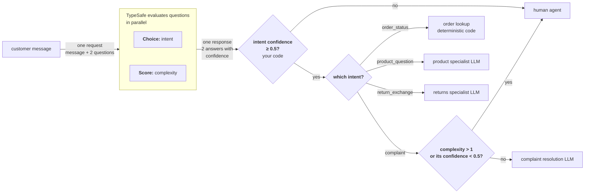

# 意图路由

> 对进来的请求分类，把每个请求路由到最合适的处理方：确定性逻辑、专用 LLM，或人工。

export function TypesafeExample({example, display, title}) {
  const keyStrUriSafe = "ABCDEFGHIJKLMNOPQRSTUVWXYZabcdefghijklmnopqrstuvwxyz0123456789+-$";
  function compressToEncodedURIComponent(input) {
    if (input == null) return "";
    return _compress(input, 6, function (a) {
      return keyStrUriSafe.charAt(a);
    });
  }
  function _compress(uncompressed, bitsPerChar, getCharFromInt) {
    if (uncompressed == null) return "";
    var i, value, context_dictionary = {}, context_dictionaryToCreate = {}, context_c = "", context_wc = "", context_w = "", context_enlargeIn = 2, context_dictSize = 3, context_numBits = 2, context_data = [], context_data_val = 0, context_data_position = 0, ii;
    for (ii = 0; ii < uncompressed.length; ii += 1) {
      context_c = uncompressed.charAt(ii);
      if (!Object.prototype.hasOwnProperty.call(context_dictionary, context_c)) {
        context_dictionary[context_c] = context_dictSize++;
        context_dictionaryToCreate[context_c] = true;
      }
      context_wc = context_w + context_c;
      if (Object.prototype.hasOwnProperty.call(context_dictionary, context_wc)) {
        context_w = context_wc;
      } else {
        if (Object.prototype.hasOwnProperty.call(context_dictionaryToCreate, context_w)) {
          if (context_w.charCodeAt(0) < 256) {
            for (i = 0; i < context_numBits; i++) {
              context_data_val = context_data_val << 1;
              if (context_data_position == bitsPerChar - 1) {
                context_data_position = 0;
                context_data.push(getCharFromInt(context_data_val));
                context_data_val = 0;
              } else {
                context_data_position++;
              }
            }
            value = context_w.charCodeAt(0);
            for (i = 0; i < 8; i++) {
              context_data_val = context_data_val << 1 | value & 1;
              if (context_data_position == bitsPerChar - 1) {
                context_data_position = 0;
                context_data.push(getCharFromInt(context_data_val));
                context_data_val = 0;
              } else {
                context_data_position++;
              }
              value = value >> 1;
            }
          } else {
            value = 1;
            for (i = 0; i < context_numBits; i++) {
              context_data_val = context_data_val << 1 | value;
              if (context_data_position == bitsPerChar - 1) {
                context_data_position = 0;
                context_data.push(getCharFromInt(context_data_val));
                context_data_val = 0;
              } else {
                context_data_position++;
              }
              value = 0;
            }
            value = context_w.charCodeAt(0);
            for (i = 0; i < 16; i++) {
              context_data_val = context_data_val << 1 | value & 1;
              if (context_data_position == bitsPerChar - 1) {
                context_data_position = 0;
                context_data.push(getCharFromInt(context_data_val));
                context_data_val = 0;
              } else {
                context_data_position++;
              }
              value = value >> 1;
            }
          }
          context_enlargeIn--;
          if (context_enlargeIn == 0) {
            context_enlargeIn = Math.pow(2, context_numBits);
            context_numBits++;
          }
          delete context_dictionaryToCreate[context_w];
        } else {
          value = context_dictionary[context_w];
          for (i = 0; i < context_numBits; i++) {
            context_data_val = context_data_val << 1 | value & 1;
            if (context_data_position == bitsPerChar - 1) {
              context_data_position = 0;
              context_data.push(getCharFromInt(context_data_val));
              context_data_val = 0;
            } else {
              context_data_position++;
            }
            value = value >> 1;
          }
        }
        context_enlargeIn--;
        if (context_enlargeIn == 0) {
          context_enlargeIn = Math.pow(2, context_numBits);
          context_numBits++;
        }
        context_dictionary[context_wc] = context_dictSize++;
        context_w = String(context_c);
      }
    }
    if (context_w !== "") {
      if (Object.prototype.hasOwnProperty.call(context_dictionaryToCreate, context_w)) {
        if (context_w.charCodeAt(0) < 256) {
          for (i = 0; i < context_numBits; i++) {
            context_data_val = context_data_val << 1;
            if (context_data_position == bitsPerChar - 1) {
              context_data_position = 0;
              context_data.push(getCharFromInt(context_data_val));
              context_data_val = 0;
            } else {
              context_data_position++;
            }
          }
          value = context_w.charCodeAt(0);
          for (i = 0; i < 8; i++) {
            context_data_val = context_data_val << 1 | value & 1;
            if (context_data_position == bitsPerChar - 1) {
              context_data_position = 0;
              context_data.push(getCharFromInt(context_data_val));
              context_data_val = 0;
            } else {
              context_data_position++;
            }
            value = value >> 1;
          }
        } else {
          value = 1;
          for (i = 0; i < context_numBits; i++) {
            context_data_val = context_data_val << 1 | value;
            if (context_data_position == bitsPerChar - 1) {
              context_data_position = 0;
              context_data.push(getCharFromInt(context_data_val));
              context_data_val = 0;
            } else {
              context_data_position++;
            }
            value = 0;
          }
          value = context_w.charCodeAt(0);
          for (i = 0; i < 16; i++) {
            context_data_val = context_data_val << 1 | value & 1;
            if (context_data_position == bitsPerChar - 1) {
              context_data_position = 0;
              context_data.push(getCharFromInt(context_data_val));
              context_data_val = 0;
            } else {
              context_data_position++;
            }
            value = value >> 1;
          }
        }
        context_enlargeIn--;
        if (context_enlargeIn == 0) {
          context_enlargeIn = Math.pow(2, context_numBits);
          context_numBits++;
        }
        delete context_dictionaryToCreate[context_w];
      } else {
        value = context_dictionary[context_w];
        for (i = 0; i < context_numBits; i++) {
          context_data_val = context_data_val << 1 | value & 1;
          if (context_data_position == bitsPerChar - 1) {
            context_data_position = 0;
            context_data.push(getCharFromInt(context_data_val));
            context_data_val = 0;
          } else {
            context_data_position++;
          }
          value = value >> 1;
        }
      }
      context_enlargeIn--;
      if (context_enlargeIn == 0) {
        context_enlargeIn = Math.pow(2, context_numBits);
        context_numBits++;
      }
    }
    value = 2;
    for (i = 0; i < context_numBits; i++) {
      context_data_val = context_data_val << 1 | value & 1;
      if (context_data_position == bitsPerChar - 1) {
        context_data_position = 0;
        context_data.push(getCharFromInt(context_data_val));
        context_data_val = 0;
      } else {
        context_data_position++;
      }
      value = value >> 1;
    }
    while (true) {
      context_data_val = context_data_val << 1;
      if (context_data_position == bitsPerChar - 1) {
        context_data.push(getCharFromInt(context_data_val));
        break;
      } else context_data_position++;
    }
    return context_data.join("");
  }
  function buildHref(ex) {
    const documentText = ex.state === undefined ? "" : typeof ex.state === "string" ? ex.state : JSON.stringify(ex.state, null, 2);
    return "https://console.typesafe.ai/decode#share/" + compressToEncodedURIComponent(JSON.stringify({
      apiVersion: "v1",
      documentText,
      promptsText: JSON.stringify(ex.questions, null, 2),
      selectedModels: ex.selectedModels
    }));
  }
  const displayedExample = display === "questions" ? example.questions : example.state === undefined ? {
    questions: example.questions
  } : {
    state: example.state,
    questions: example.questions
  };
  const code = JSON.stringify(displayedExample, null, 2);
  const href = buildHref(example);
  return <div style={{
    margin: "1.25rem 0"
  }}>
      <CodeBlock language="json" filename={title ?? "request"}>
        {code}
      </CodeBlock>
      <div className="pb-8">
        <a href={href} target="_blank" rel="noreferrer" className="text-primary">
          Try it in the Playground →
        </a>
      </div>
    </div>;
}

不是每个用户请求都需要同一类处理方。有的查一次数据库就能回答，有的需要带领域上下文的 LLM，有的需要人工。TypeSafe 可以挡在这些处理方前面，用一次又快又便宜的分类决定该调用谁。

## 示例：客服路由

设想你在做一个客服系统：消息进来后要路由到正确的处理方。与其把每条消息都送进昂贵的 LLM 去判断它属于哪类请求，不如先分类再路由。



### 第 1 步：分类意图与复杂度

<TypesafeExample
  title="questions"
  display="questions"
  example={{
questions: {
  intent: {
    type: 'choice',
    instructions: 'The primary intent of this customer message',
    criteria: {
      order_status: 'Asking about an existing order',
      product_question: 'Asking about a product before buying',
      return_exchange: 'Wants to return or exchange something',
      complaint: 'Unhappy with experience, wants resolution',
    },
  },
  complexity: {
    type: 'score',
    instructions: 'How complex is this request to resolve',
    criteria: [
      'Simple lookup or standard procedure',
      'Requires some judgment or multi-step process',
      'Unusual situation, edge case, or escalation needed',
    ],
  },
},
}}
/>

### 第 2 步：路由到最合适的处理方

```python title="routing.py" theme={null}
def route_ticket(ticket_id, response):
    intent = response.answers["intent"]
    complexity = response.answers["complexity"]

    if intent.confidence < 0.5:
        # 置信度不足以分类时，转人工客服
        return route_to_human_agent(ticket_id)

    if intent.choice == "order_status":
        handle_order_status(ticket_id)

    elif intent.choice == "product_question":
        handle_with_llm(ticket_id, PRODUCT_SPECIALIST)

    elif intent.choice == "return_exchange":
        handle_with_llm(ticket_id, RETURNS_SPECIALIST)

    elif intent.choice == "complaint":
        low_confidence = complexity.confidence < 0.5
        # complexity.score 越高，越靠近量规上「需要上报」的那一端。
        if complexity.score > 1 or low_confidence:
            # 要么复杂到无法安全自动化，要么复杂度本身拿不准，转人工。
            route_to_human_agent(ticket_id)
        else:
            handle_with_llm(ticket_id, COMPLAINT_RESOLUTION)
```

有一种意图直接走确定性代码，完全不碰 LLM；两种意图分别走不同的专用 LLM，各自加载不同的上下文；还有一种用复杂度评分来决定走人还是走 LLM。TypeSafe 用一次快速调用做完分类，昂贵的资源只在真正需要时才被使用。

注意这里对复杂度评分又做了一次置信度检查。正如[置信度](/confidence)所说，低置信度意味着什么，永远要结合系统上下文和这次决策的风险来判断。
